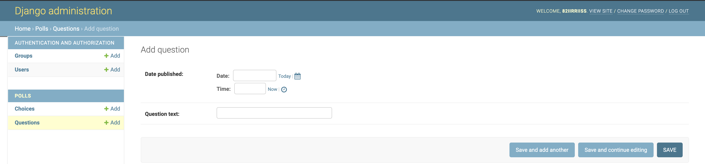
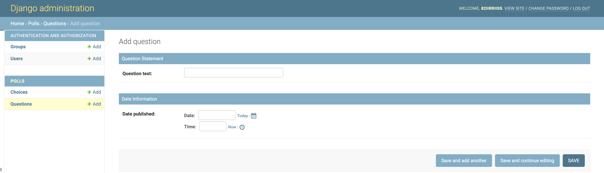
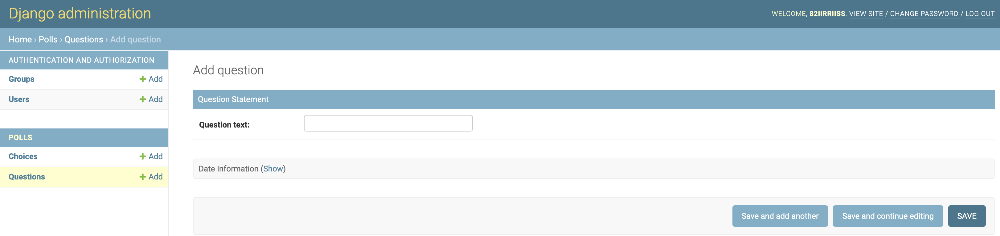
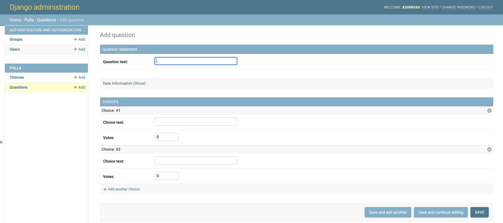
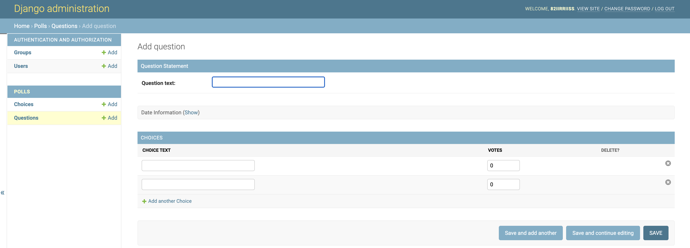
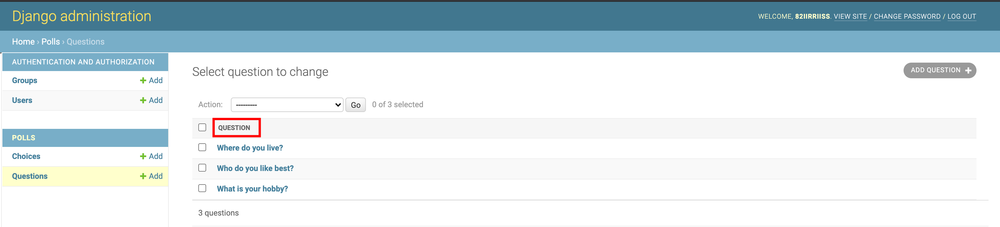
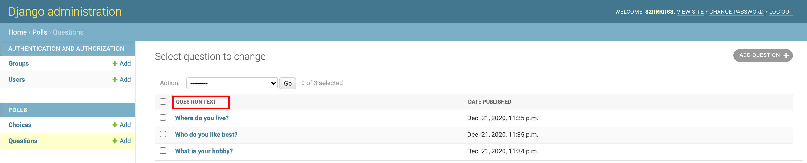
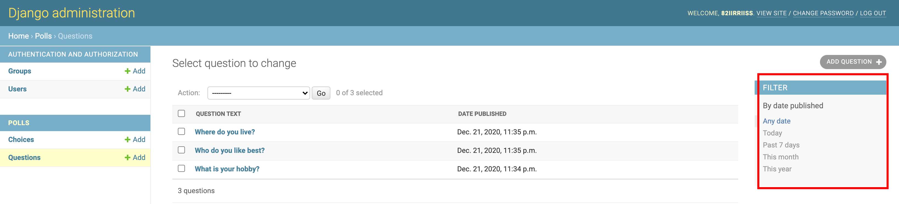
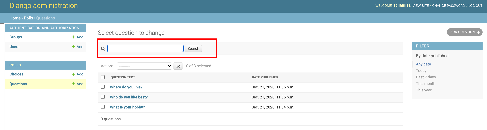
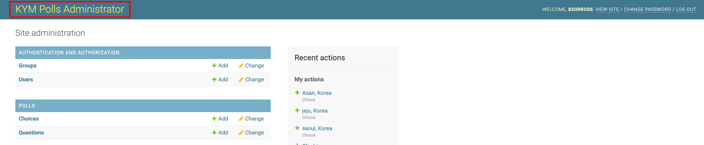

# Admin 사이트 꾸미기

## 1. 필드 순서 변경하기
 - polls/admin.py
 

```python
from django.contrib import admin
from polls.models import Question, Choice

class QuestionAdmin(admin.ModelAdmin):
    # fields 라는 속성이름은, 이미 정해져 있는 속성이름 이므로, 변경하면 안됨
    fields = ['pub_date','question_text']

admin.site.register(Question, QuestionAdmin)
admin.site.register(Choice)
```

1. ModelAdmin 을 상속받아 새로운 QuestionAdmin 클래스 정의
2. QuestionAdmin 클래스에 fields 속성 추가하여, 보여주고자 하는 순서대로 컬럼이름을 나열
3. QuestionAdmin 클래스를 admin.site.register(Question) 의 두번째 인자로 추가

## 2. 각 필드 분리해서 보여주기
 - polls/admin.py
 

```python
from django.contrib import admin
from polls.models import Question, Choice
# Register your models here.

class QuestionAdmin(admin.ModelAdmin):
    # fields = ['pub_date','question_text']
    # fieldsets 라는 속성이름은, 이미 정해져 있는 속성이름 이므로, 변경하면 안됨
    fieldsets = [('Question Statement', {'fields':['question_text']}),
                 ('Date Information', {'fields':['pub_date']})]

admin.site.register(Question, QuestionAdmin)
admin.site.register(Choice)
```

1. fieldssets 속성에 있는 각 튜플의 첫번째 인자가 해당 필드의 '제목' 이 됨

## 3. 필드 접기
- polls/admin.py
 

 ```python
class QuestionAdmin(admin.ModelAdmin):
    # fields = ['pub_date','question_text']
    fieldsets = [('Question Statement', {'fields':['question_text']}),
                 ('Date Information', {'fields':['pub_date'],'classes':['collapse']}),]

admin.site.register(Question, QuestionAdmin)
admin.site.register(Choice)
```

1. fieldsets 속성의 튜플에서 필드접기 하고 싶은 필드 속성 뒤에 `classes':['collapse']` 를 추가해 준다.

## 4. Question 테이블에 외래키를 가지고 있는 Choice  테이블을 한 화면에서 여러 개 입력하기
- polls/admin.py
 

```python
from django.contrib import admin
from polls.models import Question, Choice
# Register your models here.

class ChoiceInline(admin.StackedInline):
    model = Choice
    extra = 2

class QuestionAdmin(admin.ModelAdmin):
    # fields = ['pub_date','question_text']
    fieldsets = [('Question Statement', {'fields':['question_text']}),
                 ('Date Information', {'fields':['pub_date'],'classes':['collapse']}),]
    inlines = [ChoiceInline]

admin.site.register(Question, QuestionAdmin)
admin.site.register(Choice)
```

1. admin.StackedOnline 클래스를 상속받는 Choice 클래스를 선언하고, model 속성과 extra 속성을 작성한다.
2. QuestionAdmin 클래스에 inlines 속성으로 ChoiceInline 클래스를 지정한다.

## 5. 테이블 형식으로 보여주기
- polls/admin.py
 

 ```python
from django.contrib import admin
from polls.models import Question, Choice
# Register your models here.

# 상속받는 클래스만 변경
class ChoiceInline(admin.TabularInline):
    model = Choice
    extra = 2

class QuestionAdmin(admin.ModelAdmin):
    # fields = ['pub_date','question_text']
    fieldsets = [('Question Statement', {'fields':['question_text']}),
                 ('Date Information', {'fields':['pub_date'],'classes':['collapse']}),]
    inlines = [ChoiceInline]

admin.site.register(Question, QuestionAdmin)
admin.site.register(Choice)
 ```

 1. ChoiceInline 클래스에서 상속받는 클래스만 admin.TabularInline 으로 변경하면 됨

## 6. 레코드 리스트 컬럼 지정하기

- polls/admin.py
- 기본설정은 models.py에서 정의한 __str__() 메소드의 리턴값을 사용
- [변경전]

- [변경후]


```python
from django.contrib import admin
from polls.models import Question, Choice
# Register your models here.

class ChoiceInline(admin.TabularInline):
    model = Choice
    extra = 2

class QuestionAdmin(admin.ModelAdmin):
    # fields = ['pub_date','question_text']
    fieldsets = [('Question Statement', {'fields':['question_text']}),
                 ('Date Information', {'fields':['pub_date'],'classes':['collapse']}),]
    inlines = [ChoiceInline]
    list_display = ('question_text','pub_date')

admin.site.register(Question, QuestionAdmin)
admin.site.register(Choice)
```

1. QuestionAdmin 클래스에 'list_display' 속성을 보여주고자 하는 컬럼 이름으로 작성한다. (컬럼이름과 다르면 에러 발생.)

## 7. list_fileter 필터
- polls/admin.py


```python
from django.contrib import admin
from polls.models import Question, Choice
# Register your models here.

class ChoiceInline(admin.TabularInline):
    model = Choice
    extra = 2

class QuestionAdmin(admin.ModelAdmin):
    # fields = ['pub_date','question_text']
    fieldsets = [('Question Statement', {'fields':['question_text']}),
                 ('Date Information', {'fields':['pub_date'],'classes':['collapse']}),]
    inlines = [ChoiceInline]
    list_display = ('question_text','pub_date')
    list_filter = ['pub_date']

admin.site.register(Question, QuestionAdmin)
admin.site.register(Choice)
```

1. list_filter 속성에 데이터를 필터링 하고자 하는 컬럼이름을 지정한다.
2. 'pub_date' 컬럼에 필터를 적용하면, 지정된 기간안에 있는 데이터들만 볼 수 있다.

## 8. search_filter
> 데이터를 검색 할 수 있는 검색 필드가 생기게 된다.

.polls/admin.py


```python
from django.contrib import admin
from polls.models import Question, Choice
# Register your models here.

class ChoiceInline(admin.TabularInline):
    model = Choice
    extra = 2

class QuestionAdmin(admin.ModelAdmin):
    # fields = ['pub_date','question_text']
    fieldsets = [('Question Statement', {'fields':['question_text']}),
                 ('Date Information', {'fields':['pub_date'],'classes':['collapse']}),]
    inlines = [ChoiceInline]
    list_display = ('question_text','pub_date')
    list_filter = ['pub_date']
    search_fields = ['question_text']

admin.site.register(Question, QuestionAdmin)
admin.site.register(Choice)
```

1. search_filter 속성에 검색하고자 하는 컬럼을 지정해 준다.

## 9. admin.py 변경 내역 정리

```python
from django.contrib import admin
from polls.models import Question, Choice
# Register your models here.

class ChoiceInline(admin.TabularInline): # Question, Choice 한 화면에서 보기
    model = Choice
    extra = 2

class QuestionAdmin(admin.ModelAdmin):
    # fields = ['pub_date','question_text'] # 필드 순서 변경
    fieldsets = [('Question Statement', {'fields':['question_text']}), # 필드 분리하여 보여주기
                 ('Date Information', {'fields':['pub_date'],'classes':['collapse']}),] # 필드 펼치기 기능  추가
    inlines = [ChoiceInline] # Choice 모델 클래스 같이 보기 
    list_display = ('question_text','pub_date') # 레코드 리스트 컬럼 지정하기
    list_filter = ['pub_date'] # 리스트 필터 지정하기
    search_fields = ['question_text'] # 레코드 검색 필드 추가하기

admin.site.register(Question, QuestionAdmin)
admin.site.register(Choice)
```

## 10. Admin site 템플릿 수정하기
> Admin 사이트를 개발자 취향에 맞게 수정 할 수 있음

1. django의 설치 위치를 확인 한다.   
    `$>python -c 'import django; print(django.__path__)`

2. 프로젝트 레벨에 /templates/admin 폴더를 생성한다.
    ```
    ~ch3>mkdir templates
    ~ch3>mkdir templates/admin
    ```

3. django 설치 디렉토리 하위의 base_site.html 파일을 방금 생성한 templates/admin 하위로 복사 한다.
    ```
    ~ch3>cp [django설치경로, (1) 에서의 아웃풋]/contrib/admin/templates/admin/base_site.html ./templates/admin/base_site.html
    ```

4. settings.py 파일에 추가한 templates 경로를 작성한다.
    . ch3/mysite/settings.py
    ```
    ..(생략)
    TEMPLATES = [
        'DIRS'=[os.path.join(BASE_DIR, 'templates')],
    ]
    ...(생략)
    ```

5. base_site.html 파일을 수정한다.

    ```python
    
    # 아래 1줄 수정해 보자
    <h1 id='site-name'><a href="">KYM Polls Administration</a></h1>
    
    ```
6. 수정된 화면 확인하기
    - http://http://127.0.0.1:8000/admin/
    