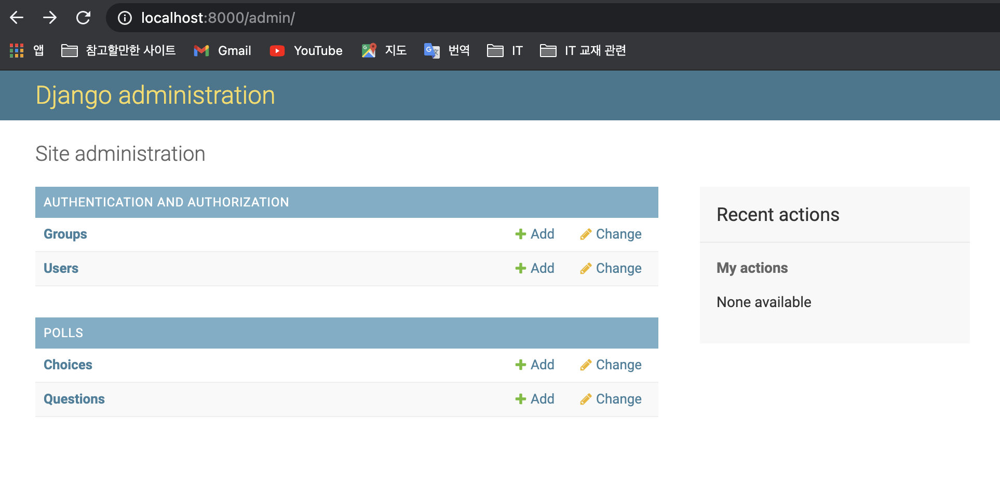

# 애플리케이션 개발하기 - Model 코딩
> 데이터베이스에 테이블을 생성하는 작업

## 1. 작업순서

```
> vim models.py     // 테이블을 정의함
> vim admins.py     // 관리자 페이지에서 테이블이 화면에 보이도록 함
> python manage.py makemigrations       // 데이터베이스에 변경이 필요한 부분 추출
> python manage.py migrate              // 데이터베이스에 변경사항 반영함
> python manage.py runserver            // 현재까지 작업을 개발서버에 반영함
```

## 2. 테이블 정의
> Question 과 Choice 두개의 테이블이 필요  
> polls/models.py 파일에 정의

```python
from django.db import models

# Create your models here.

# Question 테이블의 PK : 장고는 자동으로 Not Null & Autoincrement인 id 를 만들어 줌
class Question(models.Model):
    question_text = models.CharField(max_length=200)
    # DateTimeField의 'date published' 는 pub_date에 대한 레이블 문구. Admin 사이트에서 볼 수 있음.
    pub_date = models.DateTimeField('date published')
    # 객체를 문자열로 표현하기 위해 선언하는 함수
    def __str__ (self):
        return self.question_text

class Choice(models.Model):
    # 항상 인수로 전달된 테이블의 PK 와 연결됨. 실제 테이블에는 '_id' 라는 접미사가 붙음
    question = models.ForeignKey(Question, on_delete=models.CASCADE)
    choice_text = models.CharField(max_length=200)
    votes = models.IntegerField(default=0)

    def __str__(self):
        return self.choice_text
```

## 3. Admin 사이트에 테이블 반영
> 생성한 테이블을 admin 사이트에 보이도록 등록함
> polls/admins.py 파일

```python
from django.contrib import admin
from polls.models import Question, Choice
# Register your models here.

admin.site.register(Question)
admin.site.register(Choice)
```

## 4. 데이터베이스에 변경사항 반영
> polls/migration 디렉토리 밑에 테이블의 변경사항을 기록하는 파일이 생성됨. 이 파일은 실제 db 동기화 ( = migrate) 시, 참조하게 됨

```
ch3> python manage.py makemigrations
Migrations for 'polls':
  polls/migrations/0001_initial.py
    - Create model Question
    - Create model Choice
ch3> python manage.py migrate
Operations to perform:
  Apply all migrations: admin, auth, contenttypes, polls, sessions
Running migrations:
  Applying polls.0001_initial... OK
```

* **데이터베이스 migrate 시, 사용하게 된 aql 스키마를 아래와 같이 확인 할 수 있다**

```
ch3> python manage.py sqlmigrate polls 0001 
```

## 5. 지금까지 작업한 것 확인하기
> 웹 브라우저의 Admin 사이트에서 추가된 테이블을 확인한다.

