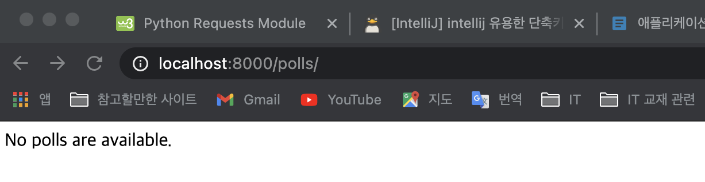
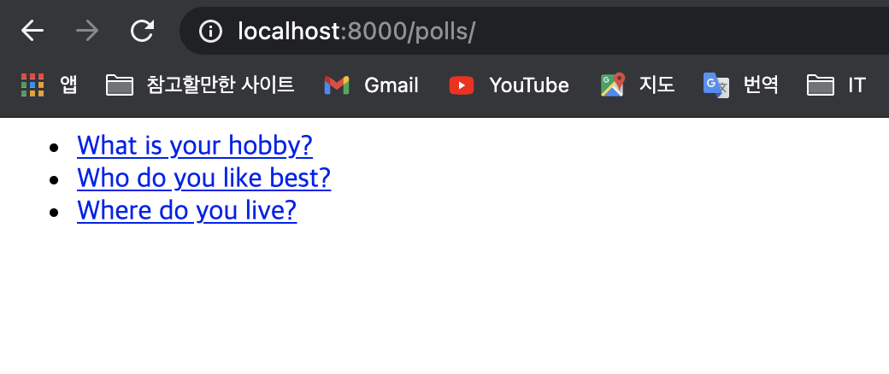
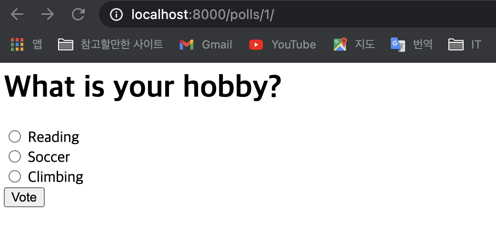
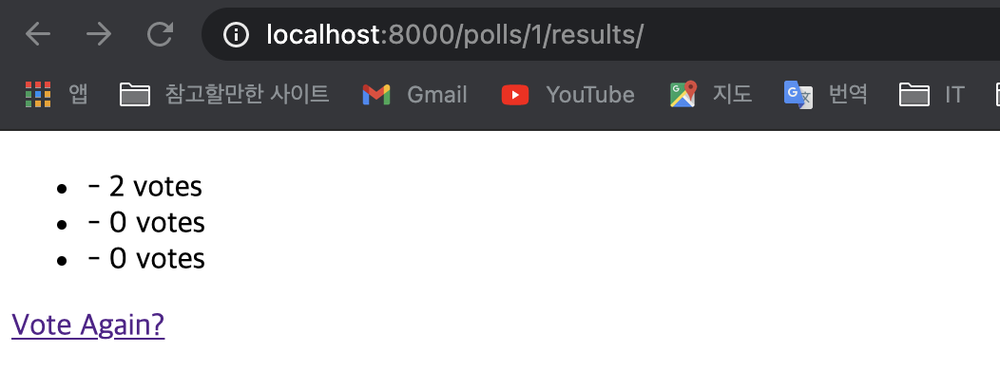

# 애플리케이션 개발하기 - URLconf, View 및 Templete 코딩
> ch3/mysite/urls.py 파일에 정의  

## 1. 처리 흐름 설계

|URL 패턴   |View 이름    |Templete 이름  |
|:---       |:---         |:---           |
|/polls/     |index()      |index.html     |
|/polls/5/   |detail()     |detail.html    |
|/polls/5/vote/  |vote()     |REDIRECT:/polls/5/result   |
|/polls/5/results/    |results()    |results.html       |

## 2. 작업 순서
> URLconf -> templete or view

1. urls.py 작성
2. views.index(), index.html 작성
3. views.detail(), detail.html 작성
4. views.vote() 작성
5. views.results(), results.html 작성

## 3. URLconf 코딩
> admin 사이트를 포함하여 5개의 url 가 필요함.
> ch3/mysite/urls.py 에 코딩

- mysite/settings.py 파일의 ROOT_URLCONF 항목이 정의되어 있으며, 이 항목에 정의된 urls.py 파일을 가장 먼저 분석함
- 지금처럼 mysite/urls.py 에 polls에 대한 urlconf를 작성할 수도 있고, mysite/urls.py와 polls/urls.py에 나누어서 작성 할 수도 있음
- <font color='red'>파일을 나누어 작성하는 방법을 추천함, 예시 2 (계층적인 구조로 유지보수에 좋음)</font>

- **예시 1** (mysite/urls.py 에 한번에 작성하는 방법)

    + mysite/urls.py
        
    ```python
    from django.contrib import admin
    from django.urls import path
    from polls import views

    # URL 패턴 매칭이 위에서 아래로 진행되므로, 순서에 유의 해야 함
    # path() 함수는, route, view 2개의 필수 인자와 kwargs, name 2개의 선택 인자를 받음
    #   route: URL 스트링
    #   view: 호출되는 뷰 함수
    #   kwargs: URL에서 추출된 파라미터 외에 추가적인 파라미터를 함수에 전달 할때 사용
    #   name: 각 URL 패턴별로 이름을 붙여줌. 이 이름을 Templete 에서 많이 사용함.
    urlpatterns = [
        path('admin/', admin.site.urls),
        path('polls/', views.index, name='index'),
        path('polls/<int:question_id>/', views.detail, name='detail'),
        path('polls/<int:question_id>/vote/',views.vote, name='vote'),
        path('polls/<int:question_id>/results/',views.results, name='results'),

    ]

    ```
- **예시 2** (mysite/urls.py와 polls/urls.py에 나누어서 작성하는 방법)
    
    + mysite/urls.py

    ```python
    from django.contrib import admin
    from django.urls import path, include
    import polls

    urlpatterns = [
        path('admin/', admin.site.urls),
        path('polls/',include('polls.urls')),
    ]
    ```

    + polls/urls.py

    ```python
    from django.urls import path
    from . import views

    # URL 패턴 매칭이 위에서 아래로 진행되므로, 순서에 유의 해야 함
    # path() 함수는, route, view 2개의 필수 인자와 kwargs, name 2개의 선택 인자를 받음
    #   route: URL 스트링
    #   view: 호출되는 뷰 함수
    #   kwargs: URL에서 추출된 파라미터 외에 추가적인 파라미터를 함수에 전달 할때 사용
    #   name: 각 URL 패턴별로 이름을 붙여줌. 이 이름을 Templete 에서 많이 사용함.

    # app_name 은, URL가 중복되는 경우 네임스페이스를 구별해 줌 (예를 들어, polls 애플리케이션과 임의의 blogs 라는 애플리케이션이 'detail' 이라는 url 패턴을 갖는 경우,)
    app_name = 'polls'
    urlpatterns = [
        path('', views.index, name='index'),                                # /polls/
        path('<int:question_id>/', views.detail, name='detail'),            # /polls/5/
        path('<int:question_id>/vote/',views.vote, name='vote'),            # /polls/5/vote/
        path('<int:question_id>/results/',views.results, name='results'),   # /polls/5/results

    ]
    ```

## 4. 뷰 함수 index() 및 템플릿 작성

### (1) 템플릿파일을 생성할 디렉토리 생성

```
~polls>mkdir templates
# templates안에 또 polls 디렉토리를 생성하여 그 하위에 템플릿 파일을 저장하는 이유는, 이름이 같은 템플릿 파일들의 충돌을 막기 위함
~polls>mkdir templates/polls
```

### (2) index.html 템플릿 파일 생성

```html
<!DOCTYPE html>
<html lang="en">
<head>
    <meta charset="UTF-8">
    <title>Title</title>
</head>
<body>
    
        <ul>
            
                <li><a href="/polls/{{ question.id }}/">{{ question.question_text }}</a> </li>
            
        </ul>
    
        <p>No polls are available.</p>
    
</body>
</html>
```

### (3) index() 뷰 함수 생성
> polls/views.py 파일에 함수 정의

```python
from django.shortcuts import render
from polls.models import Question

# Create your views here.
def index(request):
    # Question 테이블 객체에서 pub_date 컬럼의 역순으로 정렬하여 5개의 최근 Question 객체를 가져옴
    latest_question_list = Question.objects.all().order_by('-pub_date')[:5]
    context = {'latest_question_list':latest_question_list}
    # render() 는 context를 인자로 받아 HTTPResponse를 반환함
    return render(request, 'polls/index.html', context)
```

- 단축함수란?
    + 템플릿 변수를 로딩한 후에 컨텍스트 변수를 적용하고, 그 결과를 HTTPResponse 객체에 담아 반환하는 작업등의 공통 기능들을 장고에서 미리 만들어 내장함수로 제공하는 함수.
    + 예를 들어, render() 함수

## 5. 뷰 함수 detail() 및 폼 템플릿 작성

### (1) detail.html 템플릿 작성

```html

<!DOCTYPE html>
<html lang="en">
<head>
    <meta charset="UTF-8">
    <title>Title</title>
</head>
<body>
    <h1>{{ question.question_text }}</h1>
    <p><strong>{{ error_message }}</strong></p>
    <!-- url 탬플릿 태그 사용, polls:vote는 URLconf 에서 적은 url 패턴 이름   -->
    <form action="" method="post">
        <!--폼을 처리하는 경우, CSRF 공격을 방지하기 위한 기능-->
        
        <!--vote() 뷰 함수에서 request.POST['choice'] 구문으로 액세스 할 수 있음-->
        <!--input 태그의 name, id 속성은 request.POST 사전에서 key, value 로 상돋됨-->
        
            <input type="radio" name="choice" id="choice{{ forloop.counter }}" value="{{ choice.id }}"/>
            <label for="choice{{ forloop.counter }}">{{choice.choice_text}}</label><br/>
        
        <input type="submit" value = "Vote" />
    </form>
</body>
</html>

```

- choice_set 속성 : Question:Choice 의 관계가 1:N 으로, 이런 관계일 때 XXX_set 이라는 속성을 기본적으로 제공함

### (2) detail() 뷰 함수 작성

```python
from django.shortcuts import render, get_object_or_404
from polls.models import Question

# Create your views here.
# def index(request):(생략)

def detail(request, question_id):
    question = get_object_or_404(Question, pk=question_id)
    return render(request, 'polls/detail.html', {'question':question})
```
- 단축함수 `get_object_or_404` : 첫번째 인자는 모델 클래스, 두번째 인자부터 조건. 조건에 맞는 객체를 조회하고, 없으면 404 에러를 반환. 'get_list_or_404()' 함수도 있음

## 6. 뷰 함수 vote() 및 리다이렉션 작성

> detail.html 로 부터 /polls/5/vote url로 POST 방식으로 전달됨     
> detail.html : `<form action="" method='POST'>`     
> urls.py : `path('polls/<int:question_id>/vote/', views.vote, name='vote' )`   



### (1) vote() 뷰 함수 작성하고 Redirect 하기

```python
from django.shortcuts import render, get_object_or_404
from polls.models import Question, Choice
from django.http import HttpResponseRedirect
from django.urls import reverse

# Create your views here.
# def index(request): (생략)
# def detail(request, question_id):(생략)

def vote(request, question_id):
    question = get_object_or_404(Question, pk=question_id)
    try:
        selected_choice = question.choice_set.get(pk=request.POST['choice'])
    except (KeyError, Choice.DoesNotExist):
        # 설문 투표 폼을 다시 보여준다
        return render(request, 'polls/detail.html', {'question':question, 'error_message':"You didn't select a choice."})

    else:
        selected_choice.votes +=1
        selected_choice.save()
        # POST 데이터를 정상적으로 처리하였으면,
        # 항상 HttpResponseRedirect를 반환하여 리다리엑션 처리함
        return HttpResponseRedirect(reverse('polls:results', args=(question_id,)))
```

- redirect : django.http.HttpResponseRedirect 함수 사용.
- KeyError : request.POST['choice'] 의 choice 라는 키가 없을 때 발생하는 에러
- Choice.DoesNotExist : 검색 조건에 맞는 Choice 객체가 없을 때 발생하는 에러
- `reverse()` : 보통 URL 패턴의 URL 스트링으로 부터 url 검색을 시작하는데, reverse() 함수는 URL 패턴 이름으로 URL 스트링을 찾아가도록 하는 함수.
- <font color='red'>소스에 URL 스트링을 하드코딩 하지 말고 reverse() 함수를 사용하도록 함</font>

## 7. 뷰 함수 results() 와 템플릿 작성

### (1) results() 뷰 함수 작성

```python
def results(request, question_id):
    question = get_object_or_404(Question, pk=question_id)
    return render(request, 'polls/results.html', {'question':question})
```

### (2) results.html 탬플릿 작성

```html

<!DOCTYPE html>
<html lang="en">
<head>
    <meta charset="UTF-8">
    <title>Title</title>
</head>
<body>
    <h1>{{ quesiton.question_text }}</h1>
    <ul>
        
            <li>{{choice.text}} - {{choice.votes}} vote{{choice.votes|pluralize}}</li>
        
    </ul>
    <a href="">Vote Again?</a>
</body>
</html>

```

- `vote{{choice.votes|pluralize}}`: choice.votes 값에 따라 복수로 표현할지를 결정 하는 pluralize 탬플릿 필터, 결과적으로 'vote' 또는 'votes'로 보여짐

## 8. 지금까지 작업 확인하기

1. 테스트서버 실행
`$ch3>python manage.py runserver`

2. 웹 브라우저에서 'http://localhost:8000/polls' 실행
    - 현재 데이터가 하나도 없어서 빈 페이지로 나타남
        

3. Admin 사이트(http://localhost:8000/admin)로 로그인 하여, Question, Choice 테이블에 데이터 입력
    - Questions 테이블

    |question_text|Date|Time|
    |What is your hobby?|today|now|
    |What do you like best?|today|now|
    |Where do you live?|today|now|

    - Choices ( 나머지 question_text에도 3개 정도의 choice_text를 임의로 등록해 보자.)

    |question_text|choice_text|vote|
    |What is your hobby?|Reading|0|
    |What is your hobby?|Soccer|0|
    |What is your hobby?|Climbing|0|

4. 웹 브라우저에서 'http://localhost:8000/polls' 실행
    - Question 목록이 보여짐


5. 'What is your hobby?' 를 클릭하여, 'http://localhost:8000/polls/1/' 실행
    - choice 목록이 보여짐


6. 'Reading'에 체크하고 'vote' 버튼 클릭하여 'http://localhost:8000/1/vote/' 실행 -> 'http://localhost:8000/1/results' 로 redirect 됨
    - choice의 투표 결과가 보여지는 result.html 화면이 보여짐
    
