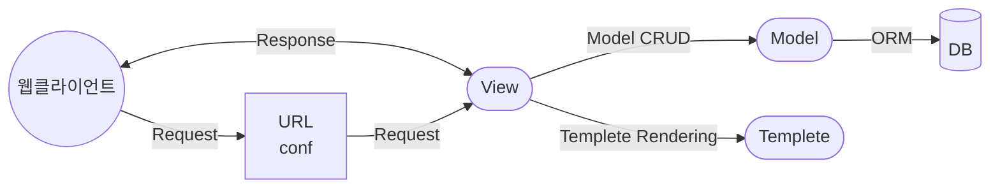

# 장고의 웹애플리케이션 개발 방식

+ 프로젝트 : 전체 프로그램
+ 애플리케이션 : 모듈화된 단위 프로그램

## 1. MVT 개발방식

### (1) MVT의 정의
1. `M` : Module ( DB테이블을 클래스로 만들어, DB와 객체를 맵핑 해주는 역할 ), modules.py 파일에 정의
2. `V` : Views (장고에서는, Controller를 View로 구분한다.), views.py 파일에 정의
3. `T` : Templete (템플릿, html 파일을 생성해 주는 템플릿 파일 ), templetes.py 파일에 정의

### (2) 예시



+ URLconf : URL을 분석하여, URL에 해당하는 뷰를 결정

## 2. Model - 데이터베이스 정의
> ORM 기법으로 테이블을 클래스로 맵핑하기 때문에 데이터베이스 엔진이 바뀌더라도 변경을 하지 않아도 된다.   
> models.py 파일에 정의   
> 참고 : <https://docs.djangoproject.com/en/3.2/topics/db/models>   

### (1) 예시   

```python
from django.db import models

class Person(models.Model):
    first_name = models.CharField(max_length=30)
    last_name = models.CharField(max_length=30)
```

+ DB에 테이블을 생성하지 않아도, 웹서버 실행 시 테이블이 없으면 자동생성 함

### (2) DB 스키마 자동 생성의 규칙
1. 테이블명 : 애플리케이션이름_모델 클래스명 (모두 소문자)
2. PrimaryKey : 장고에서 자동부여 (=id)

## 3. URLconf - URL 정의
> urls.py 파일에 정의   

### (1) 예시

```python
from django.urls import path
from . import views

urlpatterns = [
    path('articles/2003/',views.special_case_2003),
    path('articles/<int:year>/',views.year_archive),
    path('articles/<int:year>/<int:month>/',views.month_archive),
    path('articles/<int:year>/<int:month>/<slug:slug>/',views.article_detail),
]
```

### (2) URL 분석하는 순서
1. settings.py 파일에서 ROOT_URLCONF 항목을 읽어 최상위 URLconf(urls.py)의 위치를 알아냄
2. URLconf 로딩하여, urlpatterns 변수에 지정된 URL 리스트를 검사
3. 매치된 URL에 해당하는 view를 호출 (view 는 클래스나 메소드, 호출 시, HTTPRequest객체와 <>안에 정의된 파라미터를 함께 전달함)
4. 매칭에 실패시, 에러 처리하는 뷰 호출

### (3) <> (Path Converter)에 사용되는 타입
1. str : 지정하지 않으면 기본값
2. int
3. slug : slug 형식의 문자열 (ASCII, 숫자, 하이픈, 밑줄)
4. uuid 
5. path : /를 포함한 모든 문자열, 패턴의 일부가 아니라 전체를 추출

### (4) 정규표현식을 사용한 URL 표현법

+ 예시
    - path() : 타입을 사용하여 파라미터 정의
    - re_path() : 정규식을 사용하여 파라미터 정의

```python
from django.urls import path, re_path
from . import views

urlpatterns = [
    path('articles/2003/', views.special_case_2003),
    re_path(r'^articles/(?P<year>[0-9]{4})/$', views.year_archive),
    re_path(r'^articles/(?P<year>[0-9]{4})/(?P<month>[0-9]{2})/$', views.month_archive),
    re_path(r'^articles/(?P<year>[0-9]{4})/(?P<month>[0-9]{2})/(?P<slug>[\w-]+)/$',views.article_detail)
]
```

### (5) 정규표현식에 사용되는 문자들

|표현   |의미   |
|:---   |:---   |
|.(Dot) |모든 문자 1개  |
|^(Carot)    |문자열의 시작  |
|$      |문자열의 끝    |
|[]     |[]안의 문자중 하나 |
|[^]    |[]안의 문자 이외의 문자 하나   |
|*      |0회 이상 반복  |
|+      |1번 이상 반복  |
|?      |0 또는 1번 반복    |
|{n}    |n회 반복   |
|{m,n}  |m~n회 반복 |
|A\|B     |A또는 B  |
|[a-z]  |a~z의 소문자   |
|\w     |영문대문자, 영문소문자, 숫자, 밑줄 중 1글자    |
|\d     |숫자 한개  |

## 4. View - 로직정의
> 웹 요청을 받고 응답을 반환함   
> views.py 파일에 정의   
> 다양한 형태의 응답 데이터를 만들어내기 위한 로직 작성   

### (1) 예시

```python
from django.http import HttpResponse
import datetime

def current_datetime(request):
    now = datetime.datetime.now()
    html = "<html><body>It is now %s.</body></html>" % now
    return HttpResponse(html)
```

+ 에러를 응답하고 싶다면, HttpResponse클래스의 하위 클래스로 정의되어 있음   
    `return HttpResponseNotFound('<h1>Page not found</h1>')`

## 5. Templete - 화면 UI
> jango 자체 템플릿 있음, 탬플릿 태그/필터 기능 사용 가능하여 파이썬 코드를 직접 사용 가능   
> 템플릿 파일은 지정된 곳에 반드시 위치 시켜야 함   
> jango 에서 템플릿 찾을 때는, TEMPLETES 및 INSTALLED_APPS 에서 지정된 앱의 디렉토리 검색 (settings.py 파일에 정의되어 있음)   

### (1) 템플릿 위치 찾기
1. settings.py 파일에 정의
2. settings.py 파일 예제

```python
INSTALLED_APPS = [
    'django.contrib.admin',
    'django.contrib.auth',
    'django.contrib.contenttypes'
]

TEMPLETES = [
    'DIRS': [os.path.join(BASE_DIR,'templete')]
]
```

- TEMPLETES 에 정의된 디렉토리를 먼저 검색
- INSTALLED_APPS 항목에 등록된 각 앱의 templetes 디렉토리 검색

3. (2)의 파일에서 검색결과 템플릿 위치
- BASE_DIR의 위치를 /private/programmer/phthon 이라고 가정하자.

```
<!-- TEMPLETES에 정의된 디렉토리 검색 -->
/private/programmer/phthon/templetes

<!-- INSTALLED_APPS 항목에 들록된 앱에서 templetes 디렉토리 검색 -->
/Phthon3/Lib/site-packages/django/admin/templetes
/Phthon3/Lib/site-packages/django/auth/templetes
/Phthon3/Lib/site-packages/django/contenttypes/templetes
```

## 6. MVT 코딩순서
> 개발 시, 자신만의 코딩순서를 정하는 것이 로직을 풀어나가는데 일관성을 유지할 수 있고 노하우를 빨리 습득 할 수 있다.   

1. 프로젝트 뼈대 만들기 : 앱 개발에 필요한 디렉토리와 파일 생성
2. 모델 코딩하기 : 테이블 관련 사항 개발 (models.py, admin.py)
3. URLconf 코딩하기 : urls.py
4. 템플릿과 뷰를 동시에 코딩하기 : tempeletes/ 디렉토리 하위의 *.html 및 views.py
