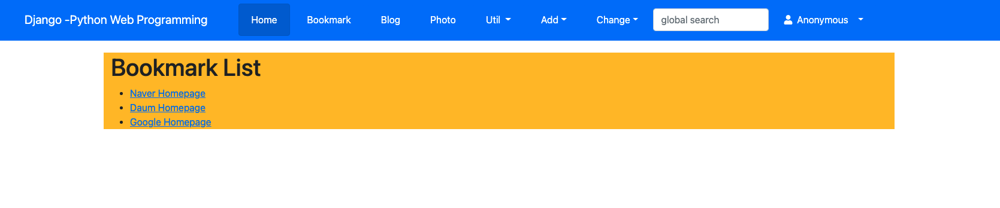
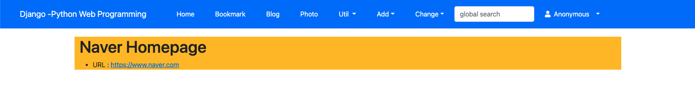

# 결과물 확인

## 가상환경 구성

#### 1. 프로젝트를 개발한 파이썬 버전을 서버(PC)에 설치한다.

- Mac OS : `brew install -r python@3.7`
- Linux : `dnf install python3.7`

#### 2. 파이썬이 설치된 위치를 확인한다.

- (ex) Mac OS : /usr/local/opt/python@3.7/Frameworks/Python.framework/Versions/3.7/bin/python3.7
- (ex) Linux : /usr/libexec/platform-python3.6m/python3.6

#### 3. .zshrc 파일에 파이썬 실행파일의 Alias 를 설정한다.

```bash
$ vim .zshrc

# ...(생략)...Alias...설정하라는 주석이 있을 것. 그 아래 설정하면 됨.
Alias python37="/usr/local/opt/python@3.7/Frameworks/Python.framework/Versions/3.7/bin/python3.7"
# esc -> wq 입력하여 저장

# 변경된 .zshrc 파일을 반영
$ source .zshrc
```

#### 4. 가상환경을 구성할 디렉토리를 생성 후, `venv` 명령어로 가상환경을 구성한다.

```bash
# 가상환경을 구성할 디렉토리
$ mkdir VENV
# 가상환경 생성 : <구성하려는버전의파이썬실행어> venv -m <가상환경디렉토리이름>
$ python37 venv -m python3.7 
```

#### 5. 가상환경을 활성화

```bash
$ cd VENV
$ source python3.7/bin/activate

# 가상환경 실행됨
(python3.7)$ 
```

#### 6. 원본 프로젝트에 설치된 패키지 목록을 이용하여 가상환경에 설치한다.

```python
# 원본 프로젝트 디렉토리
proj $ pip freeze > requirements.txt

# 가상환경에 원본 프로젝트와 같이 패키지가 설치된다.(django 등)
(phthon3.7)$ pip install -r /..(생략)../proj/requirements.txt
```

#### 7. 장고 테스트 서버로 개발된 것을 확인한다.

```python
(python3.7)$ python manage.py runserver
```
- http://localhost:8000 접속

#### 8. 화면

- bookmark_list



- bookmark_detail

