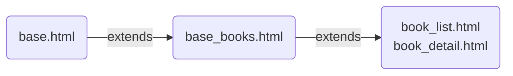

# 1. 새로운 애플리케이션 만들기
> 'books' 어플리케이션을 추가할 것이다.

- 순서
    + 어플리케이션 설계하기
    + 프로젝트 뼈대 만들기
    + 애플리케이션 - Model 코딩하기
    + 애플리케이션 - URLconf 코딩하기
    + 애플리케이션 - View 코딩하기
    + 애플리케이션 - Template 코딩하기

## 1. 애플리케이션 설계

### (1) UI 설계

|index.html|book_list.html|book_detail.html|
|----------|--------------|----------------|
|. Book<br>. Author<br>. Publisher|. Python Web Programming<br>. Design Pattern<br>. Effective Java|. Author:S.H.Kim<br>. Publisher:HanBit<br>. Publication date:March 1, 2015|

### (2) Model 설계

#### (2)-1. Book

|컬럼명|타입|제약조건|설명|
|------|----|--------|----|
|id|integer|NotNull, Pk, AutoIncrement|Pk|
|title|varchar(100)|NotNull|책제목|
|authors|integer|NotNull, MTM(Author.id), index|Many-To-Many|
|publisher|integer|NotNull, FK(publisher.id), index|Fk|
|publication_date|date|NotNull|책 출판일|

#### (2)-2. Author

|컬럼명|타입|제약조건|설명|
|------|----|--------|----|
|id|integer|NotNull, Pk, AutoIncrement|Pk|
|salutation|varchar(100)|NotNull|저자 인사말|
|name|varchar(50)|NotNull|저자 성명|
|email|varchar(50)|NotNull|저자 이메일|

#### (2)-3. Publisher

|컬럼명|타입|제약조건|설명|
|------|----|--------|----|
|id|integer|NotNull, Pk, AutoIncrement|Pk|
|name|varchar(50)|NotNull|출판사 이름|
|address|varchar(200)|NotNull|출판사 주소|
|website|url|NotNull|출판사 웹사이트|

### (3) 뷰 흐름 설계

|URL|View|Template|
|---|----|--------|
|/books/|BooksModelView.as_view()|index.html|
|/books/book/|BookList.as_view()|book_list.html|
|/books/author/|AuthorList.as_view()|author_list.html|
|/books/publisher/|PublisherList.as_view()|publisher_list.html|
|/books/book/3/|BookDetail.as_view()|book_detail.html|
|/books/author/3/|AuthorDetail.as_view()|author_detail.html|
|/books/publisher/3/|PublisherDetail.as_view()|publisher_detail.html|

## 2. 애플리케이션 - 뼈대 만들기

1. 

    ```console
    ch3>python manage.py startapp books   
    ```
2. settings.py 파일의 INSTALLED_APPS 항목에 books 어플리케이션 설정 클래스 등록

    ```python
    # settings.py

    INSTALLED_APPS = [
    'django.contrib.admin',
    'django.contrib.auth',
    'django.contrib.contenttypes',
    'django.contrib.sessions',
    'django.contrib.messages',
    'django.contrib.staticfiles',
    'polls.apps.PollsConfig',
    'books.apps.BooksConfig',
    ]
    ```

## 3. 애플리케이션 - Model 코딩하기

 - 순서

```console
ch3/books> vim models.py    // 테이블 정의
ch3/books> vim admins.py    // 테이블을 admin 사이트에 등록함
ch3> python manage.py makemigrations    //db의 변경사항을 추출함
ch3> python manage.py migrate       //db의 변경사항을 반영함
ch3> python manage.py runserver     //반영여부를 웹브라우저에서 확인함
```

1. models.py 파일에 테이블 정의
 
    ```python
    # books/models.py

    from django.db import models

    # Create your models here.
    from django.db import models

    class Book(models.Model):
        title = models.CharField(max_length=100)
        authors = models.ManyToManyField('Author')
        publisher = models.ForeignKey('Publisher', on_delete=models.CASCADE)
        publication_date = models.DateTimeField()

        def __str__(self):
            return self.title

    class Author(models.Model):
        name = models.CharField(max_length=50)
        salutation = models.CharField(max_length=100)
        email = models.EmailField()

        def __str__(self):
            return self.name

    class Publisher(models.Model):
        name = models.CharField(max_length=50)
        address = models.CharField(max_length=100)
        website = models.URLField()

        def __str__(self):
            return self.name
    ```

    - 참고 : <https://docs.djangoproject.com/en/3.1/ref/models/fields/>
    - 테이블 관계를 나타내는 필드
        + N:1 - ForeignKey(on_delete 옵션 필수)
        + N:N - ManyToManyField
        + 1:N - OneToOneField

2. admins.py 파일에 등록 : admin 사이트에 나오도록 함

    ```python
    # books/admins.py

    from django.contrib import admin

    # Register your models here.
    from django.contrib import admin
    from books.models import Book, Author, Publisher

    admin.site.register(Book)
    admin.site.register(Author)
    admin.site.register(Publisher)
    ```

3. 작업 반영하기

    ```console
    ch3>python manage.py makemigrations
    ch3>python manage.py migrate
    ```

4. 작업 확인하기
- console에 `python manage.py runserver` 로 테스트서버를 가동 시킨 후, 웹사이트에 'http://localhost:8000/admin' 으로 접속하여 등록한 테이블이 보이는지 확인한다.

## 4. 애플리케이션 - URLconf 코딩

### (1) mysite/urls.py 파일에 books 어플리케이션 index url을 등록

```python
urlpatterns = [
    path('', views.HomeView.as_view(), name='home'),
    path('admin/', admin.site.urls),
    path('polls/', include('polls.urls')),
    path('books/', include('books.urls')),
]
```

### (2) books/urls.py 파일에 books 어플리케이션 url을 등록

```python
from django.urls import path
from . import views

app_name = 'books'

urlpatterns = [
    # /books/
    path('', views.BooksModelView.as_view(), name = 'index'),
    # /books/book/
    path('book/', views.BookList.as_view(), name = 'book_list'), # 뷰 클래스 : ListView 
    # /books/author/
    path('author/', views.AuthorList.as_view(), name = 'author_list'), # 뷰 클래스 : ListView
    # /books/publichser/
    path('publisher/', views.PublisherList.as_view(), name = 'publisher_list'), # 뷰 클래스 : ListView
    # /books/book/99
    path('book/<int:pk>/', views.BookDetail.as_view(), name = 'book_detail'), # 뷰 클래스 : DetailView
    # /books/author/99
    path('author/<int:pk>', views.AuthorDetail.as_view(), name = 'author_detail'), # 뷰 클래스 : DetailView
    # /books/publisher/99
    path('publisher/<int:pk>/', views.PublisherDetail.as_view(), name = 'publisher_detail'), # 뷰 클래스 : DetailView
]
```

## 5. 애플리케이션 - 클래스형 뷰 코딩하기

```python
from django.shortcuts import render
from django.views.generic.base import TemplateView
from django.views.generic import ListView
from django.views.generic import DetailView
from books.models import Book, Author, Publisher

# Create your views here.

# 템플릿 뷰만 모델링하여 사용하는 경우 TemplateView 사용
class BooksModelView(TemplateView):
    # template_name 오버라이드 필수
    template_name = 'books/index.html'

    # 템플릿 파일에 넘겨줘야 할 데이터가 있는경우 get_context_data 오버라이드
    def get_context_data(self, **kwargs):
        # get_context_data를 오버라이드 할때는 반드시 첫줄에 super() 메소드를 호출해야 한다.
        context = super().get_context_data(**kwargs)
        context['model_list'] = ['Book', 'Author', 'Publisher']
        return context


class BookList(ListView):
    # model 테이블에 들어있는 모든 레코드를 가져와 구성하는 경우에는 테이블명만 지정해 주면 된다.
    # object_list 속성 자동구성
    # 템플릿 파일 모델명_list.html 자동구성
    model = Book

class AuthorList(ListView):
    model = Author

class PublisherList(ListView):
    model = Publisher

# pk로 조회해서 특정 객체를 가져오는 경우에는 테이블명만 명시 해주면 된다.
# 컨텍스트 변수로 object 를 자동으로 사용함
# 템플릿 파일을 모델명_detail.html 로 자동으로 사용함
class BookDetail(DetailView):
    model = Book

class AuthorDetail(DetailView):
    model = Author

class PublisherDetail(DetailView):
    model = Publisher
```
- ListView, DetailView, TemplateView의 설명은 주석을 참고

## 6. 애플리케이션 - Template 코딩

### (1) URL/VIEW/TEMPLATE 맵핑관계

|URL 패턴|VIEW|TEMPLATE 파일명|
|/books/|BooksModelView|index.html|
|/books/book|BookList|book_list.html|
|/books/author/|AuthorList|author_list.html|
|/books/publisher/|PublisherList|publisher_list.html|
|/books/book/3/|BookDetail|book_detail.html|
|/books/auathor/3/|AuthorDetail|author_detail.html|
|/books/publisher/3/|PublisherDetail|publisher_detail.html|

### (2) Layout 만들기 : 3단계 권장



- ch3/templates/base.html
    ```
    
    <!DOCTYPE html>
    <html lang="en">
    <head>
        
        <link rel="stylesheet" href="" />
        <meta charset="UTF-8">
        <title>My Amazing Site</title>
    </head>
    <body>
        <div id="sidebar">
            
            <ul>
                <li><a href="/">Project_Home</a> </li>
                <li><a href="/admin/">Admin</a> </li>
            </ul>
            
            <br>
        </div>

        <div id="content">
            
        </div>
    </body>
    </html>
    
    ```
    - `load static` 으로 static 이라는 사용자 정의 태그 로딩 후, `static` 사용자 정의 태그를 통해 admin/css/base.css 스타일 파일을 찾게 함 

- ch3/templates/base_books.html
    ```
    
    

    <title>Books Application Site</title>
    
        {{ block.super }}
        <ul>
            <li><a href="/books/">Books_Home</a></li>
        </ul>
    
    
    ```
    - sidebar 블록을 이어쓰려면, {{block.super}} 를 필수로 해 주어야 함
- ch3/books/templates/books/book_detail.html (나머지 author_detail.html, publisher_detail.html 도 유사함)
    ```
    
    

    
        <h1>{{ object.title }}</h1>
        <br>
        <li>Authors:
            
                {{ author }}
            ,
            
            
            
        </li>
        <li>Publisher: {{ object.publisher }}</li>
        <li>Publication Date: {{ object.publication_date }}</li>
    
    
    ```
    - DetailView 에서는 모델의 조회 결과를 object 파라미터로 넘겨 주므로 object 파라미터를 사용함

- ch3/books/templates/books/book_list.html(나머지 author_list.html, publisher_list.html 도 유사함)
    ```
    
    
     Book List 
    
    <h2>Book List</h2>
        <ul>
            
            <li><a href="" >{{ book.title }}</a></li>
            
        </ul>
    
    
    ```
    - ListView 에서는 모델의 조회 결과를 object 파라미터로 넘겨 주므로 object 파라미터를 사용함

## 7. home 페이지 작성
- (http://localhost:8000) 접속 시 보여지는 첫 페이지

1. mysite/urls.py 'urlpatterns'에 경로 추가 
    - ` path('', views.HomeView.as_view(), name='home'),`

2. mysite/views.py 에 하기 코딩 추가

    ```python
    from django.views.generic.base import TemplateView
    from django.apps import apps

    class HomeView(TemplateView):
        template_name = 'home.html'

        # 템플릿에 데이터를 전달하려면 get_context_data를 오버라이딩 해야 함
        def get_context_data(self, **kwargs):
            context = super().get_context_data(**kwargs)
            # context['app_list'] = ['polls','books']
            dictVerbose = {}
            # 각 애플리케이션의 apps.py 에 선언된 속성들의 값을 순회
            for app in apps.get_app_configs():
                # 그 중, site-packages 에 있는 app 속성은 외브 라이브러리 이므로, 제외하는 코딩
                if 'site-packages' not in app.path:
                    dictVerbose[app.label] = app.name

            context['verbose_dict'] = dictVerbose
            return context

    ```
    - 주석 참조
3. home.html 작성

    ```
    
    

    
        <h2>YMkim Django Application</h2>
        <ul>
            
                
                    <li><a href="">{{ value }}</a></li>
                
            
        </ul>
    
    
    ```
    
## 8. Polls 애플리케이션 - 클래스 형 뷰로 전환
- github에 올려 둔 소스를 참고하세요.   
    - github 주소 : <https://github.com/82iirriiss/python_basic_project>

## 9. 로그 추가하기

1. 로그 디렉토리 생성
`ch3>mkdir logs`

2. settings.py 파일에 로그 설정하기
- 각 컴포넌트 (formatters, handlers, loggers, filters)는 모두 's'로 끝나니 철자 주의할 것 

```
    LOGGING = {
    'version': 1,
    'disable_existing_loggers': False,
    'formatters': {
        'verbose': {
            'format': '[%(asctime)s] %(levelname)s [%(name)s:%(lineno)s] %(message)s',
            'datefmt': '%d/%b/%Y %H:%M:%S'
        },
    },
    'handlers': {
            'file': {
                'level': 'DEBUG',
                'class': 'logging.FileHandler',
                'filename': os.path.join(BASE_DIR, 'logs', 'mysite.log'),
                'formatter': 'verbose'
            }
    },
    'loggers': {
        'polls': {
            'handlers': ['file'],
            'level': 'DEBUG'
        }
    }
}
```

