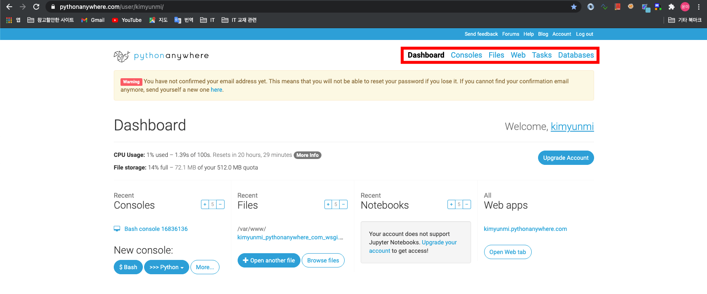
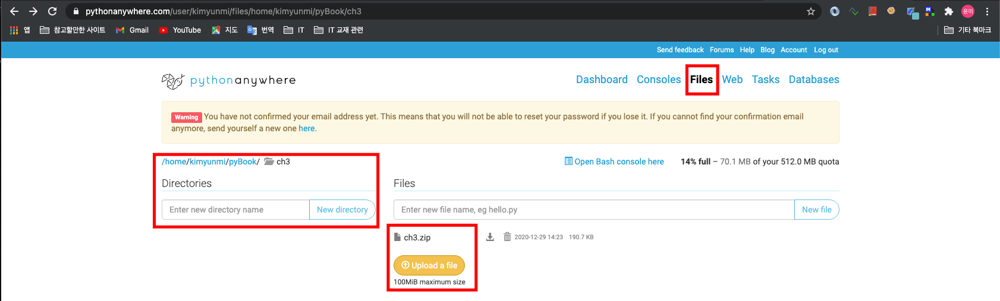
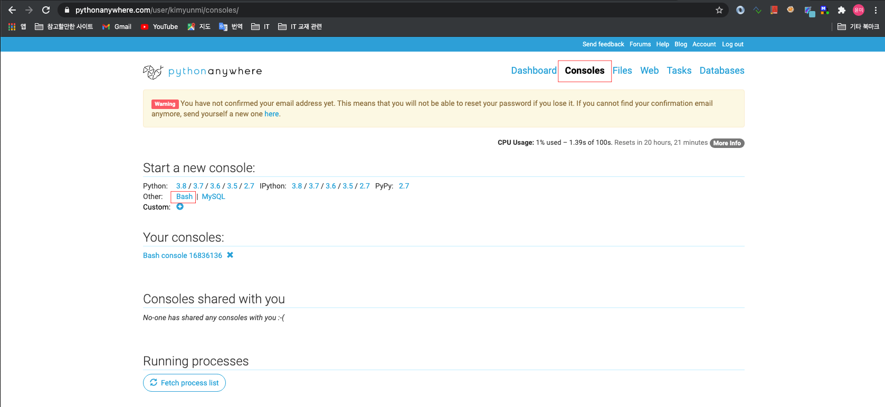
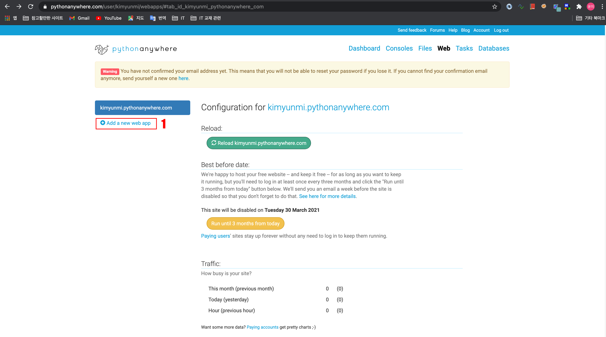

# PythonAnyWhere에 장고소스 배포하기

## 1. PythonAnyWhere 가입하기/로그인하기

1. 접속: <www.pythonanywhere.com>
2. 신규가입 : signup - 'Create a Beginner ACCOUNT' - 개인정보 입력 후 'Register' (이메일 컨펌이 필요함)
- Beginner은, 도메인명을 바꿀 수 없으며, 장고 앱도 하나만 실행 할 수 있음 
3. 로그인

## 2. 장고 소스 올리기


- Dashboard : 나의 사이트에 대한 CPU 사용량등 전체현황
- Consoles : Bash쉘, Python쉘 작업창
- Files : 파일과 디렉토리를 보거나, 파일 업로드
- Web : 장고 앱을 실행하기 위해 필요한 항목 설정
- Task : cron 작업 명령
- Databases : mySql DB를 사용하기 위한 메뉴. 장고는 sqlite3를 사용하므로 사용하지 않음

1. file 로 이동


2. Directories 에 'pyBook/ch3'를 입력하여 'New Directory' 버튼을 입력하여 프로젝트 폴더를 생성
3. 'Upload File'을 눌러 내 PC에서 압축한 프로젝트파일(ch3.zip)을 업로드 한다

## 3. 리눅스 명령어로 압축 풀기

1. 'console' 화면으로 이동 - Bash 클릭하여 업로드 했던 파일 압축을 푼다
```console
$ cd pyBook/ch3
$ unzip ch3.zip
$ tree -L 3
.
├── ch3
│   ├── books
│   │   ├── __init__.py
│   │   ├── __pycache__
│   │   ├── admin.py
│   │   ├── apps.py
│   │   ├── migrations
│   │   ├── models.py
│   │   ├── templates
│   │   ├── tests.py
│   │   ├── urls.py
│   │   └── views.py
│   ├── db.sqlite3
│   ├── logs
│   │   └── mysite.log
│   ├── manage.py
│   ├── mysite
│   │   ├── __init__.py
│   │   ├── __pycache__
│   │   ├── asgi.py
│   │   ├── settings.py
│   │   ├── urls.py
│   │   ├── views.py
│   │   └── wsgi.py
│   ├── polls
│   │   ├── __init__.py
│   │   ├── __pycache__
│   │   ├── admin.py
│   │   ├── apps.py
│   │   ├── forms.py
│   │   ├── migrations
│   │   ├── models.py
│   │   ├── templates
│   │   ├── tests.py
│   │   ├── urls.py
│   │   └── views.py
│   └── templates
│       ├── admin
│       ├── base.html
│       ├── base_books.html
│       ├── base_polls.html
│       └── home.html
└── ch3.zip
```

## 4. 가상환경 만들기

- Bash 쉘에서 계속 작업한다.

```bash
$ cd /home/kimyunmi/
$ mkdir VENV
$ cd VENV
# python3.8을 사용하는 v3PyBook 가상환경을 생성
$ virtualenv --python python3.8 v3PyBook
# 가상환경 안으로 이동
$ source /home/kimyunmi/VENV/v3PyBook/bin/activate
# 가상환경에서 장고 설치
(v3PyBook) $ pip install Django
# 설치 목록 확인
(v3PyBook) $ pip list

# 가상환경 종료는,
(v3PyBook) $ deactivate
```

## 5. PythonAnyWhere 웹서버에서 장고 설정 변경하기
- PythonAnyWhere 안에서 웹서버가 실행되고 있음
- 장고의 'console' 을 열고 settings.py를 수정한다.

```console
$ cd /home/kimyunmi/pyBook/ch3/ch3/mysite
$ vim settings.py

# i 나 a 로 편집모드로 진입하여 편집
ALLOWED_HOST = ['kimyunmi.pythonanywhere.com', 'localhost', '127.0.0.1'] # 변경

STATIC_URL = '/static/'
STATIC_ROOT = os.path.join(BASE_DIR, 'www_dir', 'static')
# ESC + :wq 로 종료

$ cd /home/kimyunmi/pyBook/ch3/ch3
$ source /home/kimyunmi/VENV/v3PyBook/bin/activate
(v3PyBook) $ python manage.py collectstatic
```

## 6. PythonAnyWhere 웹서버 설정하기
- 웹서버가 장고를 인식 할 수 있도록, 웹서버의 설정을 변경해야 한다

1. 'Web' 메뉴 선택 - 'Add a new web app' 선택 - 'Select a Python Web framework' 대화창에서 'Manual configuration (including virtualenvs)' 선택 - 'Select a Python version' 대화창에서 내가 개발한 파이썬 버전 선택  - 'Next' 클릭하여 마법사 종료

2. 설정마법사가 종료되면, 일단 웹서버는 가동 중이다. 웹 서버 설정을 변경 해 보자
 
    1. Code 섹션의 WSGI configuration file 을 클릭, 아래와 같이 수정한다.

    ```python
    import os
    import sys

    # 프로젝트 루트 디렉토리 지정
    path = 'home/kimyunmi/pyBook/ch3/ch3'
    if path not in sys.path:
        sys.path.append(path)

    os.environ['DJANGO_SETTINGS_MODULE'] = 'mysite.settings'

    from django.core.wsgi import get_wsgi_application
    application = get_wsgi_application()
    ```

    2. Virtualenv 섹션에서 v3PyBook의 가상환경 경로를 입력하고 체크버튼 클릭   
    `/home/kimyunmi/VENV/v3PyBook/`
    3. Static files 섹션에서 URL과 Directory 에 settings.py의 STATIC_ROOT 설정 항목 값을 등록한다
        - URL : /static/
        - Directory : /home/kimyunmi/pyBook/ch3/ch3/www_dir/static

3. 모든 설정을 완료 한 후 초록색 Reload 버튼 클릭하여 웹서버 재 시작한다.

## 7. 지금까지 작업한 것 확인하기
- 웹 브라우저에 'kimyunmi(본인의 계정명).pythonanywhere.com' 을 실행하면, 페이지가 열린다.