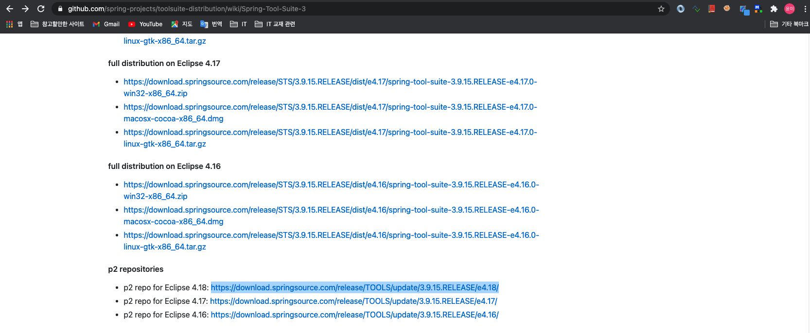
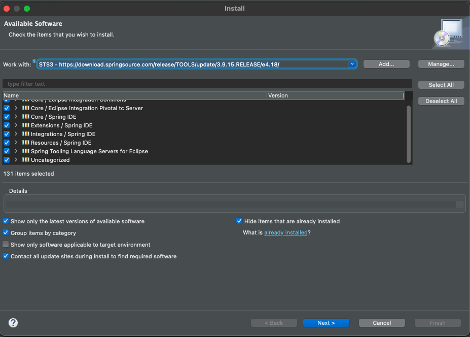
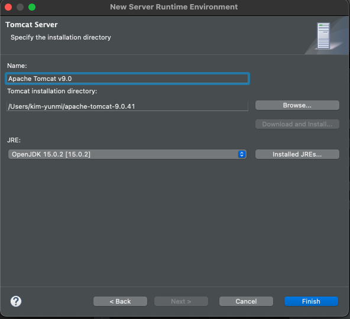
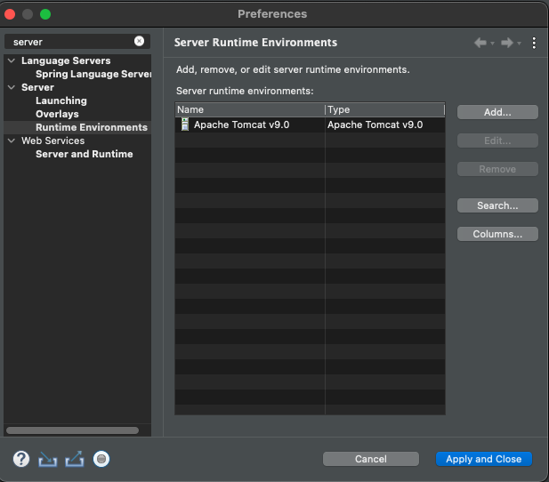
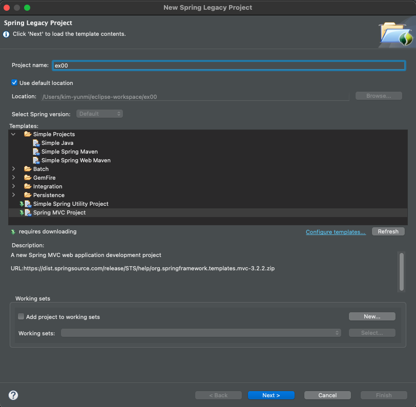
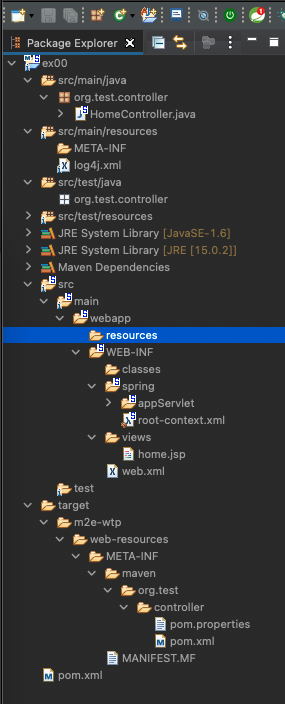
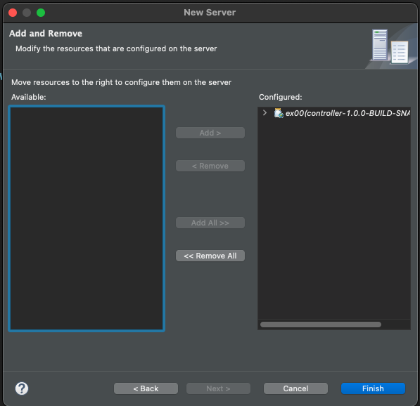
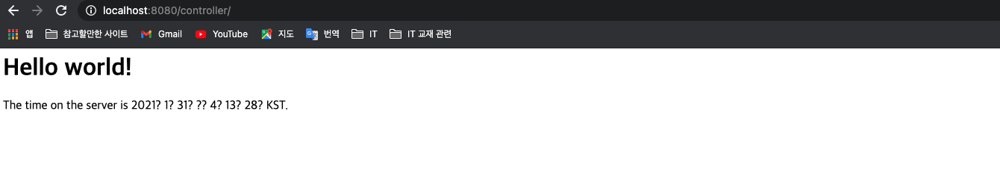
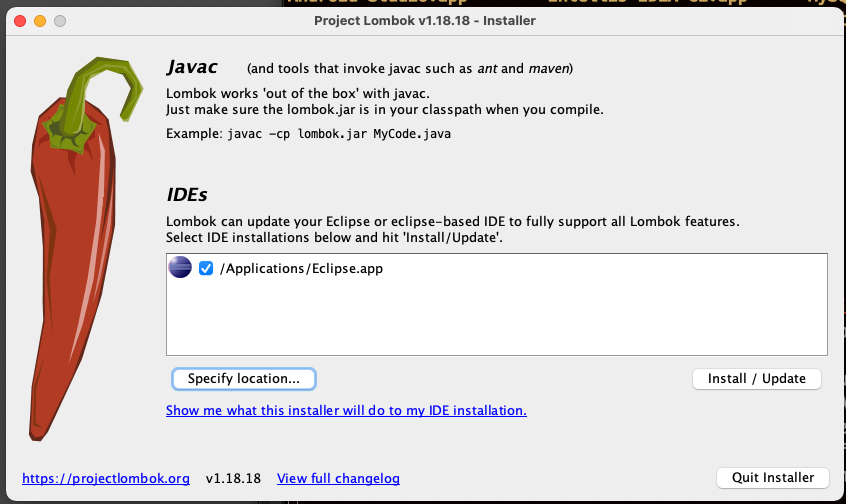

# 스프링 개발환경 구축

## <font color='blue'>1. 개발 준비</font>
- JDK 1.8 설치 (현재 2021년, 탐캣 9.x 버전이 jdk 1.8 기반임.)
- `openJdk 11 이상 설치 해 보았으나, Servlet과의 호환성 문제 발생 및 정상빌드 되지 않음. jdk 1.8로 개발할 것.`
- STS(Eclipse) 설치
- 탐캣 설치 & 연동
- 오라클 설치 & SQL Developer 설치
- MyBatis & mybatis-spring 설치
- 스프링 MVC 개발 설정

## <font color='blue'>2. 개발 환경 설정</font>

**(1) JDK 설치**

- *스프링은 버전에 따라 JDK 제한이 있으므로 버전에 주의 할 것!*

    |스프링 |JDK |
    |:------|:---|
    |5.x    |1.8 이상|
    |4.x    |1.6 이상|
    |3.x    |1.5 이상|

- *JDK 설치*

```bash
java version "1.8.0_281"
Java(TM) SE Runtime Environment (build 1.8.0_281-b09)
Java HotSpot(TM) 64-Bit Server VM (build 25.281-b09, mixed mode)
```

- *환경변수에 JAVA_HOME 추가 & PATH에 JAVA_HOME/bin 추가*

```bash
$vim .zshrc
JAVA_HOME=/Library/java/JavaVirtualMachines/jdk-1.8.0_281.jdk/Contents/Home
export JAVA_HOME
export PATH=$HOME/bin:${JAVA_HOME}/bin:$PATH
# esc + :wq 로 저장
# .zshrc 반영
$source .zshrc
```

**(2) 개발툴 (IDE) 설치 및 셋팅**

- [ ] STS (Eclipse 기반의 스프링 개발 툴, Spring Tool Suit) 설치하는 방법
- [x] Eclipse 설치 후 Spring 플러그인 설치하는 방법 : 경험자
- 다운로드 : <https://www.eclipse.org/downloads/> 의 `Eclipse IDE for Enterprise Java Developers` 설치 (2020-06 버전 사용하였음. jdk 1.8 지원.)
- Eclipse 실행환경 편집 ( /Applications/development/Eclipse.app/Contents/Eclipse/eclipse.ini) : jre의 환경설정을 jdk 로 변경(lombok등의 라이브러리 사용이 지장 받을 수 있음.)

```ini
-vm
## ../Eclipse/plugins/org.eclipse.justj.openjdk.hotspot.jre.full.macosx.x86_64_15.0.1.v20201027-0507/jre/lib/libjli.dylib
/Library/java/JavaVirtualMachines/jdk-1.8.0_281.jdk/Contents/MacOS/libjli.dylib
```

- Eclipse 의 workspace의 기본문자열 인코딩을 `utf-8`로 모두 변경 (아마 기본적으로 utf-8로 셋팅되어 있을 것이다.)

```
Eclipse > Preferences > General > Workspace 에서 변경, Web의 HTML, JSP, CSS 도 변경
```

- Eclipse 실행 후, `Preference`의 `Installed JRE`를 `jdk-1.8.0_281.jdk`로 변경한다.

**(3) Eclipse 에 STS3 플러그인 설치 (STS4는, 스프링부트를 위한 툴)**

- 플러그인 주소 확인
-> https://github.com/spring-projects/toolsuite-distribution/wiki/Spring-Tool-Suite-3 
-> p2 repo for Eclipse 4.18: https://download.springsource.com/release/TOOLS/update/3.9.15.RELEASE/e4.18/



- 플러그인 설치
-> eclipse > Help > Install New Software... > Work with 필드의 'add' 
-> Name : STS3
-> Location : https://download.springsource.com/release/TOOLS/update/3.9.15.RELEASE/e4.18/
-> 플러그인 전체 체크 후 설치



- eclipse 재시작
- 'Perspective' 항목에 'Spring' 항목 추가된 것을 확인


**(4) 탐캣 서버 설정**

- 다운로드 <https://tomcat.apache.org> : tomcat9.x 버전을 zip 이나 tar.gz 형태로 다운로드 후, 원하는 경로에 압축을 해제함
- Eclipse > Preferences > Server > runtime server > Add > 'Apache Tomcat 9' 선택 > 압축을 푼 디렉토리를 선택





## <font color='blue'>3. 스프링 프로젝트 설정</font>
- [x] 스프링 프로젝트를 지정하고 생성하는 방식
- [ ] Maven/Gradle 빌드도구로 프로젝트 생성 후, 프레임워크 추가하는 방법
- [ ] 직접 프레임워크 라이브러리 추가하는 방법

**(1) 'ex00'프로젝트 생성**
- `Perspective`를 `Spring`으로 지정
- file > New > `spring Legacy Project` > `Spring MVC Project` 선택 



- 패키지명 (hostname 거꾸로 한 형태) : `org.test.controller`


- 프로젝트 생성 완료

|프로젝트 트리|설명|
|:------------|----|
||src/main/java -> 코드<br>src/main/resources -> 설정파일<br> spring/appServlet/servlet-context.xml -> 웹관련 스프링 설정<br>web.xml -> 탐캣 설정파일<br>pom.xml -> 메이븐 설정파일|

**(2) 스프링 버전 변경하기**
- 'Spring Lagacy Project' 는 JDK 1.6, Spring 3 버전으로 초기 설정되므로 설정을 변경해야 함
- `pom.xml` 파일에서 spring 버전을 5.x 로 변경 (maven spring 버전을 확인)

```xml
# pom.xml
<properties>
    <java-version>1.8</java-version>
    <org.springframework-version>5.2.12.RELEASE</org.springframework-version>
    <org.aspectj-version>1.6.10</org.aspectj-version>
    <org.slf4j-version>1.6.6</org.slf4j-version>
</properties>
```

- 버전이 성공적으로 변경되면, maven 라이브러리의  spring 버전이 모두 5.2.12 로 변경된다.


**(3) java 버전 변경하기**
- JDK 1.6을 1.8 버전으로 변경한다.
(내 PC에 jdk 1.8 버전을 설치 하였기 때문.)

```xml
<plugin>
    <groupId>org.apache.maven.plugins</groupId>
    <artifactId>maven-compiler-plugin</artifactId>
    <version>2.5.1</version>
    <configuration>
        <source>1.8</source>
        <target>1.8</target>
        <compilerArgument>-Xlint:all</compilerArgument>
        <showWarnings>true</showWarnings>
        <showDeprecation>true</showDeprecation>
    </configuration>
</plugin>
```

- 프로젝트 우클릭 > Maven > Update Project
- Package Explorer의 JRE SystemLibrary 내 라이브러리 버전이 모두 1.8 로 변경되었음을 확인한다.

**(4) 프로젝트 환경 구성 JDK 1.8 로 변경**
- 프로젝트 우클릭 > `Project facets` > java 버전을 1.8로 변경
- 프로젝트 우클릭 > `java compile` > java 1.8 로 선택되어 있어야 한다.
- JRE SystemLibrary에 `JRE System Library[jdk-1.8.0_281.jdk]` 라고 보여져야 한다.

**(5) Servlet 버전 변경**
- Spring Lagacy Project 로 생성한 프로젝트는 서블릿이 2.5로 되어 있으니, 이것을 3.0 이상으로 변경한다.
- `서블릿 3.0 이상은 jdk 1.7 이상에서만 설정 할 수 있다. 그런데 11,15 등과 같은 버전은 에러가 발생하여 현재로써는 jdk 1.8로 설정하는 것이 최선이다.`
- pom.xml 

```xml
<!-- Servlet -->
<!-- https://mvnrepository.com/artifact/javax.servlet/javax.servlet-api -->
<dependency>
	<groupId>javax.servlet</groupId>
	<artifactId>javax.servlet-api</artifactId>
	<version>3.1.0</version>
	<scope>provided</scope>
</dependency>

<!-- https://mvnrepository.com/artifact/javax.servlet.jsp/javax.servlet.jsp-api -->
<dependency>
	<groupId>javax.servlet.jsp</groupId>
	<artifactId>javax.servlet.jsp-api</artifactId>
	<version>2.3.3</version>
	<scope>provided</scope>
</dependency>
```


**(6) 탐캣 설정**

- Window > Show View > Server 선택 : 하단에 Server 뷰가 보인다.
- Server 뷰에서 '서버추가하기' 를 클릭하여 tomcat 서버를 추가한다. (서버추가하라는 영문이지...진짜 '서버추가하기'는 아님.)
- 실제로는 tomcat 9.x 를 추가하였다. (jdk1.8을 지원하는 탐캣. 그림과는 다름.)


- 추가한 탐캣에 작성중인 프로젝트를 추가한다.



- 서버를 실행한다 (Run > Run as > Run on server)
- 웹브라우저에서 정상실행되는지 확인한다.




## <font color='blue'>4. Lombok 라이브러리 설치</font>
- Lombok : getter, setter, toString(), 생성자 자동생성등
- Lombok은, 프로젝트 뿐만 아니라 Eclipse 에디터 내에서도 사용하므로 별도로 설치 해야 함
- 다운로드 : <https://projectlombok.org/download> 에서 jar 파일 형태로 받을 수 있음.
- lombok 설치

```bash
$ java -jar lombok.jar
```

- `specify location...` > Eclipe 설치 위치를 지정
- MacOS의 경우, Eclipse 는 `Applications/Eclipse.app` 의 위치에 있어야만 정상적으로 IDE를 인식한다. (Applications/다른폴더/Eclipse.app 일 때는, 인식하지 못함)
- `install/Update` 하여 lombok 설치
- 결과적으로, `/Applications/Eclipse.app/Contents/Eclipse/lombok.jar` 의 위치로 lombok.jar가 복사되었다.
- 또는, Eclipse > Help > Install New SoftWare 에서 lombok의 저장소를 적고, 롬복을 설치해도 된다.



## <font color='blue'>5. XML이 아닌 *Java Configuration* 을 하기위한 준비</font>

- **(1) web.xml 삭제** : web.xml, servlet-context.xml, root-context.xml

- **(2) 스프링 관련파일 삭제** : spring 폴더 삭제

- **(3) pom.xml 수정 및 스프링 버젼 변경**

- *web.xml 을 사용하지 않도록 설정을 `추가`해야 함*

```xml
<plugin>
    <groupId>org.apache.maven.plugins</groupId>
    <artifactId>maven-war-plugin</artifactId>
    <version>3.2.0</version>
    <configuration>
        <failOnMissingWebXml>false</failOnMissingWebXml>
    </configuration>
</plugin>
```

- *pom.xml의 스프링 버전 및 java 버젼도 함께 `변경`해야 함.*

```xml
<properties>
    <java-version>1.8</java-version>
    <org.springframework-version>5.2.12.RELEASE</org.springframework-version>
    <org.aspectj-version>1.6.10</org.aspectj-version>
    <org.slf4j-version>1.6.6</org.slf4j-version>
</properties>
```

- *pom.xml의 컴파일 관련 버전 역시 `변경`하고 `Maven > Update > Update Project` 실행*


```xml
<plugin>
    <groupId>org.apache.maven.plugins</groupId>
    <artifactId>maven-compiler-plugin</artifactId>
    <version>2.5.1</version>
    <configuration>
        <source>1.8</source>
        <target>1.8</target>
        <compilerArgument>-Xlint:all</compilerArgument>
        <showWarnings>true</showWarnings>
        <showDeprecation>true</showDeprecation>
    </configuration>
</plugin>
```

- **(4) 설정관련 JAVA 파일 개발**

- *`src/main/java` 하위에 `org.example.config` 패키지 생성*

- *`org.example.config` 패키지에 `RootConfig.java` 클래스 생성 - `root-context.xml` 을 대체하는 설정파일*


```java
//RootConfig.java
package org.example.config;

import org.springframework.context.annotation.Configuration;

@Configuration
public class RootConfig {
}
```

- *`org.example.config` 패키지 하위에 `WebConfig.java` 클래스 생성 - `web.xml` 을 대체하는 설정파일*

- AbstractAnnotationConfigDispatcherServletInitializer 추상클래스를 상속


```java
//WebConfig.java
package org.example.config;

import org.springframework.web.servlet.support.AbstractAnnotationConfigDispatcherServletInitializer;

public class WebConfig extends
AbstractAnnotationConfigDispatcherServletInitializer {

    @Override
    protected Class<?>[] getRootConfigClasses() {
        // TODO Auto-generated method stub
        return null;
    }

    @Override
    protected Class<?>[] getServletConfigClasses() {
        // TODO Auto-generated method stub
        return null;
    }

    @Override
    protected String[] getServletMappings() {
        // TODO Auto-generated method stub
        return null;
    }

}

```

- *`RootConfig.java`*를 방금 생성한 `WebConfig.java`의 `getRootConfigClasses()`메소드에 적용한다.

```java
package org.example.config;

import org.springframework.web.servlet.support.AbstractAnnotationConfigDispatcherServletInitializer;

public class WebConfig extends
AbstractAnnotationConfigDispatcherServletInitializer {

	@Override
	protected Class<?>[] getRootConfigClasses() {
		// TODO Auto-generated method stub
		return new Class[] {RootConfig.class};
	}

	@Override
	protected Class<?>[] getServletConfigClasses() {
		// TODO Auto-generated method stub
		return null;
	}

	@Override
	protected String[] getServletMappings() {
		// TODO Auto-generated method stub
		return null;
	}

}
```


## <font color='blue'>6. 스프링과 오라클 연동</font>

### (1) DB 설치
- 오라클 : MacOS 는 지원하지 않으므로 VM 에 설치해야 함.
- mySql 설치 : HOMEBREW 패키지 설치

```zsh
> brew update
> brew install mysql@8
# mysql 설치 확인 : list결과 mysql 있으면 설치됨
> brew list
```

- mySql 실행

```zsh
> mysql.server start
Starting MySQL
SUCCESS!
```

- mySql 설정

```zsh
> mysql_secure_installation
mysql_secure_installation: [ERROR] unknown variable 'default-character-set=utf8'.
Securing the MySQL server deployment.
Enter password for user root:
# 비밀번호를 복잡하게 설정할 것인지, 쉬운 비밀번호를 사용할 것인지 Yes | No => No
VALIDATE PASSWORD COMPONENT can be used to test passwords
and improve security. It checks the strength of password
and allows the users to set only those passwords which are
secure enough. Would you like to setup VALIDATE PASSWORD component?

Press y|Y for Yes, any other key for No: No
# root 유저의 비밀번호 설정
New password:
Re-enter new password:
# 사용자에 대한 설정 Yes (-u 옵션 필요) | No (-u 옵션 필요 없음) => Yes
By default, a MySQL installation has an anonymous user,
allowing anyone to log into MySQL without having to have
a user account created for them. This is intended only for
testing, and to make the installation go a bit smoother.
You should remove them before moving into a production
environment.

Remove anonymous users? (Press y|Y for Yes, any other key for No) : Yes
# 원격 접속 허용 여부 : 다른 IP에서 root 로 접속을 허용할지 확인 Yes | No => No
Normally, root should only be allowed to connect from
'localhost'. This ensures that someone cannot guess at
the root password from the network.

Disallow root login remotely? (Press y|Y for Yes, any other key for No) : No
# TEST 데이터베이스 설정 여부 : Y (TEST 데이터베이스 삭제) | N (TEST 데이터베이스 유지) => Y
y default, MySQL comes with a database named 'test' that
anyone can access. This is also intended only for testing,
and should be removed before moving into a production
environment.

Remove test database and access to it? (Press y|Y for Yes, any other key for No) : yes

- Dropping test database...
Success.
 - Removing privileges on test database...
Success.
# 변경된 권한을 테이블에 적용할지 여부 확인 : Yes (적용) | No (미적용) => Yes
Reloading the privilege tables will ensure that all changes
made so far will take effect immediately.

Reload privilege tables now? (Press y|Y for Yes, any other key for No) : yes
# 설정 완료
All done!
```

- mySql 접속 확인

```zsh
> mysql -u root -P 3306 -p
Enter password : [패스워드 입력]

mysql >
```

- mysql 설정파일 구성 확인 및 변경 : `/usr/local/Cellar/mysql/8.0.22_1/.bottle/etc/my.conf`

```zsh
> vim my.conf

[mysqld]

character-set-server=utf8

collation-server=utf8_general_ci

init_connect=SET collation_connection=utf8_general_ci

init_connect=SET NAMES utf8

[client]

default-character-set=utf8

[mysql]

default-character-set=utf8
```

- 프로젝트에서 접속할 DB와 사용자 생성

```zsh
# 데이터베이스 생성
mysql> CREATE DATABASE testdb;
# 사용자 생성
mysql> CREATE USER 'book_ex'@'localhost' IDENTIFIED BY 'password';
# 사용자 권한 지정
mysql> grant all privileges on testdb.* to 'book_ex'@'localhost';
# 또는,
mysql> GRANT INSERT,UPDATE,INDEX,ALTER ON on testdb.* TO 'book_ex'@'localhost';
mysql>FLUSH PRIVILEGES;
```

### (2) 프로젝트의 JDBC 연결
- 오라클의 경우는, ojdbc8.jar 등의 라이브러리를 build path 에 추가해야 한다. 그리고 war를 만들 때도 jar 파일이 포함되도록 `Web Deployment Assembly` 항목에도 jar 파일을 추가한다.
- mySql의 경우, pom.xml 에 `mysql-connector-java`를 추가한 것으로 충분하다.

### (3) JDBC 연결 테스트

- `src/test/java` 폴더에 `org.example.persistence` 패키지 추가
- `JDBCTests.java` 클래스 생성

```java
package org.example.persistence;

import static org.junit.Assert.fail;

import java.sql.Connection;
import java.sql.DriverManager;
import java.sql.SQLException;

import org.junit.Test;

import lombok.extern.log4j.Log4j;

@Log4j
public class JDBCTest {

	static {
		try {
			Class.forName("com.mysql.cj.jdbc.Driver");
		} catch (Exception e) {
			e.printStackTrace();
		}
	}
	
	@Test
	public void testConnection() {
		Connection conn = null;
		try{
			conn = 
				DriverManager.getConnection("jdbc:mysql://localhost/testDb?characterEncoding=UTF-8&serverTimezone=UTC",
						"book_ex",
						"password");
			log.info(conn);
			conn.close();
		} catch (SQLException e) {
			
			fail(e.getMessage());
		} 
	}
}

```

- `Junit Test` 시, 테스트 성공하면 잘 설정 된 것임.


### (4) 커넥션풀 설정
> 커넥션 풀 : 필요할 때마다 Connection을 맺는게 아니라, 이미 맺어둔 Connection 들을 `Connection Pool`에 등록하여 `DataSource` 라는 인터페이스를 통해 Connection 을 사용한다.   
> `spring-jdbc` 대신 요즘 유행하는 `HikariCP`를 사용한다.

- pom.xml 에 HikariCP 라이브러리를 추가 (Maven에서 HikariCP 검색)

```xml
<!-- https://mvnrepository.com/artifact/com.zaxxer/HikariCP -->
<dependency>
<groupId>com.zaxxer</groupId>
<artifactId>HikariCP</artifactId>
<version>3.4.5</version>
</dependency>
```

- root-context.xml 또는 RootConfig.java 에 HikariCP 의 설정을 Bean으로 등록한다

```xml
<bean id='hikariconfig' class='com.zaxxer.hikari.HikariConfig'>
    <property name='driverClassName' value='com.mysql.cj.jdbc.Driver'></property>
    <property name='jdbcUrl' value='jdbc:mysql://localhost:3306/testDb'></property>
    <property name='username' value='book_ex'></property>
    <property name='password' value='password'></property>
    <property name='serverTimezone' value='UTC'></property>
</bean>

<bean id='dataSource' class='com.zaxxer.hikari.HikariDataSource' destroy-method='close'>
    <constructor-arg ref='hikariconfig' />
</bean>
``` 

- 또는....

```java
// RootConfig.java

package org.example.config;

import javax.sql.DataSource;

import org.springframework.context.annotation.Bean;
import org.springframework.context.annotation.ComponentScan;
import org.springframework.context.annotation.Configuration;

import com.zaxxer.hikari.HikariConfig;
import com.zaxxer.hikari.HikariDataSource;

@Configuration
@ComponentScan(basePackages = {"org.example.sample"})
public class RootConfig {

	@Bean
	public DataSource dataSource() {
		HikariConfig config = new HikariConfig();
		config.setJdbcUrl("jdbc:mysql://localhost:3306/testDb");
		config.setUsername("book_ex");
		config.setPassword("password");
		config.addDataSourceProperty("serverTimezone", "UTC");

		HikariDataSource ds = new HikariDataSource(config);
		return ds;
	}
}
```

### (5) Connection-Pool & DataSource 테스트

- `src/test/java` 폴더의 `org.example.persistence` 패키지 `DataSourceTest.java` 파일 

```java
package org.example.persistence;

import static org.junit.Assert.fail;

import java.sql.Connection;

import javax.sql.DataSource;

import org.example.config.RootConfig;
import org.junit.Test;
import org.junit.runner.RunWith;
import org.springframework.beans.factory.annotation.Autowired;
import org.springframework.test.context.ContextConfiguration;
import org.springframework.test.context.junit4.SpringJUnit4ClassRunner;

import lombok.Setter;
import lombok.extern.log4j.Log4j;

@RunWith(SpringJUnit4ClassRunner.class)
@ContextConfiguration(classes= {RootConfig.class})
@Log4j
public class DataSourceTest {

	@Setter(onMethod = @__({@Autowired}))
	private DataSource ds; 
	
	@Test
	public void testConnection() {
		Connection conn = null;
		try{
			conn = ds.getConnection();
			log.info(conn);
		} catch (Exception e) {
			fail(e.getMessage());
		}
	}
}
```


## <font color='blue'>7. 스프링과 myBatis 연동</font>

### (1) myBatis의 장점
> 자동으로 Connection close()   
> 리턴타입 지정하면 자동으로 객체생성 및 ResultSet 처리   
> `mybatis-spring` 라이브러리 제공   

### (2) MyBatis 관련 라이브러리 추가
- pom.xml 에 추가
- `spring-jdbc` : 데이터베이스 처리
- `spring-tx` : 트랜젝션 처리
- `mybatis` : mybatis 처리
- `mybatis-spring` : 스프링과 mybatis 연동 처리

```xml
<!-- https://mvnrepository.com/artifact/org.mybatis/mybatis -->
<dependency>
    <groupId>org.mybatis</groupId>
    <artifactId>mybatis</artifactId>
    <version>3.5.4</version>
</dependency>

<!-- MyBatis-Spring -->
<!-- https://mvnrepository.com/artifact/org.mybatis/mybatis-spring -->
<dependency>
    <groupId>org.mybatis</groupId>
    <artifactId>mybatis-spring</artifactId>
    <version>2.0.3</version>
</dependency>

<!-- Spring-jdbc -->
<!-- https://mvnrepository.com/artifact/org.springframework/spring-jdbc -->
<dependency>
    <groupId>org.springframework</groupId>
    <artifactId>spring-jdbc</artifactId>
    <version>${org.springframework-version}</version>
</dependency>

<!-- https://mvnrepository.com/artifact/org.springframework/spring-tx -->
<dependency>
    <groupId>org.springframework</groupId>
    <artifactId>spring-tx</artifactId>
    <version>${org.springframework-version}</version>
</dependency>
```

### (3) SqlSessionFactoryBean 등록
- `SqlSession` : MyBatis의 가장 핵심적인 객체. SqlSettion 통해서 Connection 생성 또는 SQL 전달, 결과 리턴 받음.
- `SqlSessionFactoryBean` : SqlSession 을 만들어내는 `SqlSessionFactory` 를 등록할 때 이용

- root-context.xml 에 등록하는 경우

```xml
<!-- HikariCP configuration -->
<bean id='dataSource' class='com.zaxxer.hikari.HikariDataSource' destroy-method='close'>
    <constructor-arg ref='hikariconfig' />
</bean>
<!-- SqlSessionFactory configuration -->
<bean id='sqlSessionFactory' class='org.mybatis.spring.SqlSessionFactoryBean'>
    <property name='dataSource' ref='dataSource'></property>
</bean>
```

- RootConfig.java에 @Bean으로 등록하는 경우

```java
package org.example.config;

import javax.sql.DataSource;

import org.apache.ibatis.session.SqlSessionFactory;
import org.mybatis.spring.SqlSessionFactoryBean;
import org.springframework.context.annotation.Bean;
import org.springframework.context.annotation.ComponentScan;
import org.springframework.context.annotation.Configuration;

import com.zaxxer.hikari.HikariConfig;
import com.zaxxer.hikari.HikariDataSource;

@Configuration
@ComponentScan(basePackages = {"org.example.sample"})
public class RootConfig {

	@Bean
	public DataSource dataSource() {
		HikariConfig config = new HikariConfig();
		config.setJdbcUrl("jdbc:mysql://localhost:3306/testDb");
		config.setUsername("book_ex");
		config.setPassword("password");
		config.addDataSourceProperty("serverTimezone", "UTC");
		config.addDataSourceProperty("cachePrepStmts", "true");
		config.addDataSourceProperty("prepStmtCacheSize", "250");
		config.addDataSourceProperty("prepStmtCacheSqlLimit", "2048");

		HikariDataSource dataSource = new HikariDataSource(config);
		return dataSource;
	}
	
	@Bean
	public SqlSessionFactory sqlSessionFactory() throws Exception {
		SqlSessionFactoryBean sqlSessionFactory = new SqlSessionFactoryBean();
		sqlSessionFactory.setDataSource(dataSource());
		return (SqlSessionFactory) sqlSessionFactory.getObject();
	}
}
```

### (4) SqlSessionFactory & Connection 테스트

- `src/test/java` 폴더의 `org.example.persistence` 패키지 `DataSourceTest.java` 파일 

```java
package org.example.persistence;

import static org.junit.Assert.fail;

import java.sql.Connection;

import javax.sql.DataSource;

import org.apache.ibatis.session.SqlSession;
import org.apache.ibatis.session.SqlSessionFactory;
import org.example.config.RootConfig;
import org.junit.Test;
import org.junit.runner.RunWith;
import org.springframework.beans.factory.annotation.Autowired;
import org.springframework.test.context.ContextConfiguration;
import org.springframework.test.context.junit4.SpringJUnit4ClassRunner;

import lombok.Setter;
import lombok.extern.log4j.Log4j;

@RunWith(SpringJUnit4ClassRunner.class)
@ContextConfiguration(classes= {RootConfig.class})
@Log4j
public class DataSourceTest {

	@Setter(onMethod = @__({@Autowired}))
	private DataSource ds; 
	
	@Setter(onMethod = @__({@Autowired}))
	private SqlSessionFactory sqlSessionFactory;
	
	
	@Test
	public void testMyBatis() {
		
		try(SqlSession session = sqlSessionFactory.openSession();
			Connection	conn = session.getConnection();
			){
			log.info(session);
			log.info(conn);
		}
		catch (Exception e) {
			fail(e.getMessage());
		}
	}
	
	
//	@Test
//	public void testConnection() {
//		Connection conn = null;
//		try{
//			conn = ds.getConnection();
//			log.info(conn);
//		} catch (Exception e) {
//			fail(e.getMessage());
//		}
//	}
}
```

### (5) 스프링과 MyBatis + Mapper와 연동 처리
> Mapper : SQL과 그 처리를 하는 클래스를 연결하는 역할   
> ① Mapper + 인터페이스 + 어노테이션 으로 작성할 수도 있고,   
> ② XML + 인터페이스 + 어노테이션의 형태로 작성 할 수도 있음.   

--------------------------------------------------------------
<font color='green'>5-1. Mapper 설정</font>
- Mybatis XML Mapper 참조 : <http://www.mybatis.org/mybatis-3/ko/sqlmap-xml.html>
    
> **<font color='purple'>xml 설정을 이용하는 경우</font>**    
> root-context.xml 에 설정하기 : `<mybatis:scan>` 태그 이용       
> root-context.xml 창 하단의 'Namespaces' 항목에서 'mybatis-spring' 항목 체크       
> `<mybatis-spring:scan>`에 지정된 패키지의 모든 MyBatis 어노테이션을 찾아서 처리      
    
```xml
<mybatis-spring:scan base-package='org.example.mapper'/>
```

> **<font color='purple'>Java 설정을 이용하는 경우</font>**       
> `@MapperScan`을 이용하여 처리   

```java
package org.example.config;

import javax.sql.DataSource;

import org.apache.ibatis.session.SqlSessionFactory;
import org.mybatis.spring.SqlSessionFactoryBean;
import org.mybatis.spring.annotation.MapperScan;
import org.springframework.context.annotation.Bean;
import org.springframework.context.annotation.ComponentScan;
import org.springframework.context.annotation.Configuration;

import com.zaxxer.hikari.HikariConfig;
import com.zaxxer.hikari.HikariDataSource;

@Configuration
@ComponentScan(basePackages = {"org.example.sample"})
@MapperScan(basePackages = {"org.example.mapper"})
public class RootConfig {

    @Bean
    public DataSource dataSource() {
        HikariConfig config = new HikariConfig();
        config.setJdbcUrl("jdbc:mysql://localhost:3306/testDb");
        config.setUsername("book_ex");
        config.setPassword("password");
        config.addDataSourceProperty("serverTimezone", "UTC");
        config.addDataSourceProperty("cachePrepStmts", "true");
        config.addDataSourceProperty("prepStmtCacheSize", "250");
        config.addDataSourceProperty("prepStmtCacheSqlLimit", "2048");

        HikariDataSource ds = new HikariDataSource(config);
        return ds;
    }
    
    @Bean
    public SqlSessionFactory sqlSessionFactory() throws Exception {
        SqlSessionFactoryBean sqlSessionFactory = new SqlSessionFactoryBean();
        sqlSessionFactory.setDataSource(dataSource());
        return (SqlSessionFactory) sqlSessionFactory.getObject();
    }
}
```
------------------------------------------------------------------------------------
*<font color='green'>5-2. Java 인터페이스와 Mybatis 어노테이션 이용한 예제</font>*

> <font color='black'>인터페이스</font>   
> `src/main/java` 폴더 `org.example.mapper` 패키지 `TimeMapper.java` 인터페이스   
> `@Select` MyBatis 어노테이션 이용   
 
```java
package org.example.mapper;

import org.apache.ibatis.annotations.Select;

public interface TimeMapper {

	@Select("SELECT sysdate() FROM dual")
	public String getTime();
}
```

> <font color='black'>테스트</font>    
> `src/test/java` 폴더 `org.example.persistance` 패키지 `TimeMapperTests.java` 클래스 

```java
package org.example.persistence;

import org.example.config.RootConfig;
import org.example.mapper.TimeMapper;
import org.junit.Test;
import org.junit.runner.RunWith;
import org.springframework.beans.factory.annotation.Autowired;
import org.springframework.test.context.ContextConfiguration;
import org.springframework.test.context.junit4.SpringJUnit4ClassRunner;

import lombok.Setter;
import lombok.extern.log4j.Log4j;

@RunWith(SpringJUnit4ClassRunner.class)
@ContextConfiguration(classes = {RootConfig.class})
@Log4j
public class TimeMapperTests {

	@Setter(onMethod = @__({@Autowired}))
	private TimeMapper timeMapper;
	
	@Test
	public void testGetTime() {
		log.info(timeMapper.getClass().getName());
		log.info(timeMapper.getTime());
	}
}
```

----------------------------------------------------------------------------------
*<font color='green'>5-3. XML + Java 인터페이스 이용한 예제</font>*

> <font color='black'>인터페이스</font>       
> `src/main/java` 폴더 `org.example.mapper` 패키지 `TimeMapper.java` 인터페이스    

```java
package org.example.mapper;

import org.apache.ibatis.annotations.Select;

public interface TimeMapper {

	public String getTime2();
}
```

> <font color='black'>XML</font>     
> `src/main/resources` 폴더 `org/example/mapper` 폴더 `TimeMapper.xml`   
> `namespace` : xml 에서 처리할 인터페이스의 위치와 같게 설정함   
> `id` : 인터페이스에서 처리할 메소드명
> `resultType` : 처리할 메소드의 반환타입   
> 선언은 인터페이스, SQL 처리는 XML 에서!   

```xml
<?xml version="1.0" encoding="UTF-8" ?>
<!DOCTYPE mapper
  PUBLIC "-//mybatis.org//DTD Mapper 3.0//EN" "http://mybatis.org/dtd/mybatis-3-mapper.dtd">

<mapper namespace="org.example.mapper.TimeMapper">

  <select id="getTime2" resultType="string">
    select sysdate() from dual
  </select>

</mapper>
```

> <font color='black'>테스트</font>       
> `src/test/java` 폴더 `org.example.persistance` 패키지 `TimeMapperTests.java` 클래스 

```java
package org.example.persistence;

import org.example.config.RootConfig;
import org.example.mapper.TimeMapper;
import org.junit.Test;
import org.junit.runner.RunWith;
import org.springframework.beans.factory.annotation.Autowired;
import org.springframework.test.context.ContextConfiguration;
import org.springframework.test.context.junit4.SpringJUnit4ClassRunner;

import lombok.Setter;
import lombok.extern.log4j.Log4j;

@RunWith(SpringJUnit4ClassRunner.class)
@ContextConfiguration(classes = {RootConfig.class})
@Log4j
public class TimeMapperTests {

	@Setter(onMethod = @__({@Autowired}))
	private TimeMapper timeMapper;
	
	@Test
	public void testGetTIme2() {
		log.info(timeMapper.getClass().getName());
		log.info(timeMapper.getTime2());
	}
}
```

### (6) log4jdbc-log4j2 설정

> JDBC의 PreparedStatement의 SQL 로그를 ? 가 아닌 실제 값으로 보기위한 라이브러리.   

*<font color='green'>6-1. 라이브러리 추가</font>*

- pom.xml

```xml
<!-- https://mvnrepository.com/artifact/org.bgee.log4jdbc-log4j2/log4jdbc-log4j2-jdbc4.1 -->
<dependency>
    <groupId>org.bgee.log4jdbc-log4j2</groupId>
    <artifactId>log4jdbc-log4j2-jdbc4</artifactId>
    <version>1.16</version>
</dependency>
```

-----------------------------------------------------------------------------------
*<font color='green'>6-2. 로그 설정 파일 추가</font>*

> `src/mian/resources` 밑에 `log4jdbc.log4j2.properties` 파일

```ini
log4jdbc.spylogdelegator.name=net.sf.log4jdbc.log.slf4j.Slf4jSpyLogDelegator
# log4jdbc.auto.load.popular.drivers = false
```
-----------------------------------------------------------------------------------
*<font color='green'>6-3. JDBC 연결정보 수정</font>*

> RootConfig.java

```java
package org.example.config;

import javax.sql.DataSource;

import org.apache.ibatis.session.SqlSessionFactory;
import org.mybatis.spring.SqlSessionFactoryBean;
import org.mybatis.spring.annotation.MapperScan;
import org.springframework.context.annotation.Bean;
import org.springframework.context.annotation.ComponentScan;
import org.springframework.context.annotation.Configuration;

import com.zaxxer.hikari.HikariConfig;
import com.zaxxer.hikari.HikariDataSource;

@Configuration
@ComponentScan(basePackages = {"org.example.sample"})
@MapperScan(basePackages = {"org.example.mapper"})
public class RootConfig {

	@Bean
	public DataSource dataSource() {
		HikariConfig config = new HikariConfig();
        // driver 추가 (기본 드라이버 로드 안되도록 properties 에서 설정함.)
		config.setDriverClassName("net.sf.log4jdbc.sql.jdbcapi.DriverSpy");
        //jdbc: 다음부분에 log4jdbc 추가함.
		config.setJdbcUrl("jdbc:log4jdbc:mysql://localhost:3306/testDb");
		//config.setJdbcUrl("jdbc:mysql://localhost:3306/testDb");
		config.setUsername("book_ex");
		config.setPassword("password");
		config.addDataSourceProperty("serverTimezone", "UTC");
		config.addDataSourceProperty("cachePrepStmts", "true");
		config.addDataSourceProperty("prepStmtCacheSize", "250");
		config.addDataSourceProperty("prepStmtCacheSqlLimit", "2048");

		HikariDataSource ds = new HikariDataSource(config);
		return ds;
	}
	
	@Bean
	public SqlSessionFactory sqlSessionFactory() throws Exception {
		SqlSessionFactoryBean sqlSessionFactory = new SqlSessionFactoryBean();
		sqlSessionFactory.setDataSource(dataSource());
		return (SqlSessionFactory) sqlSessionFactory.getObject();
	}
}
```

*<font color='green'>6-4. 로그레벨</font>*

- 참고: <https://logging.apache.org/log4j/2.x/manual/customloglevels.html>
- 로그레벨은 마지막 <root> 구문의 영향을 받음.                      
- main 소스 ( src/main/resources/log4j.xml ) 의 경우, 로그레벨을 'warn'으로 하여, 불필요한 정보를 유출하지 않음.              
- test 소스 ( src/test/resources/log4j.xml ) 의 경우, 로그레벨을 'info'로 하여, 개발자가 필요한 정보를 많이 볼 수 있도록 설정함.                

```xml
<root>
    <priority value="info"/>
    <appender-ref="console">
</root>
```