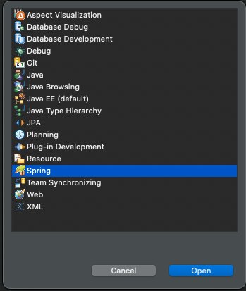
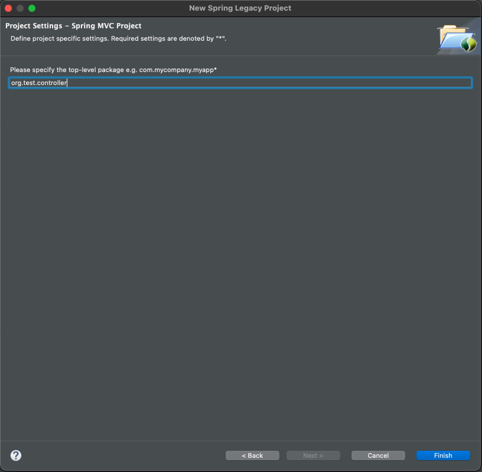
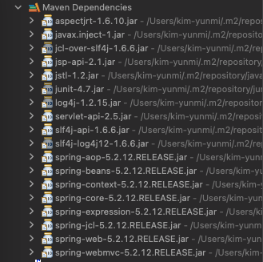
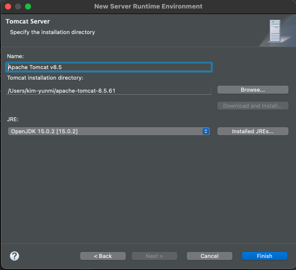

# 스프링 개발환경 구축

## 1. 개발 준비
- JDK 1.8 설치 (현재 2021년, 탐캣 9.x 버전이 jdk 1.8 기반임.)
- STS(Eclipse) 설치
- 탐캣 설치 & 연동
- 오라클 설치 & SQL Developer 설치
- MyBatis & mybatis-spring 설치
- 스프링 MVC 개발 설정

## 2. 개발 환경 설정

**(1) JDK 설치**

- *스프링은 버전에 따라 JDK 제한이 있으므로 버전에 주의 할 것!*

    |스프링 |JDK |
    |:------|:---|
    |5.x    |1.8 이상|
    |4.x    |1.6 이상|
    |3.x    |1.5 이상|

- *JDK 설치*

```bash
➜  jdk-15.0.2.jdk java --version
openjdk 15.0.2 2021-01-19
OpenJDK Runtime Environment (build 15.0.2+7-27)
OpenJDK 64-Bit Server VM (build 15.0.2+7-27, mixed mode, sharing)
```

- *환경변수에 JAVA_HOME 추가 & PATH에 JAVA_HOME/bin 추가*

```bash
$vim .zshrc
JAVA_HOME=/Users/kim-yunmi/Library/java/JavaVirtualMachines/jdk-15.0.2.jdk
export JAVA_HOME
export PATH=$HOME/bin:${JAVA_HOME}/bin:$PATH
# esc + :wq 로 저장
# .zshrc 반영
$source .zshrc
```

**(2) 개발툴 (IDE) 설치 및 셋팅**

- [ ] STS (Eclipse 기반의 스프링 개발 툴, Spring Tool Suit) 설치하는 방법
- [x] Eclipse 설치 후 Spring 플러그인 설치하는 방법 : 경험자
- 다운로드 : <https://www.eclipse.org/downloads/> 의 `Eclipse IDE for Enterprise Java Developers` 설치
- Eclipse 실행환경 편집 ( /Applications/development/Eclipse.app/Contents/Eclipse/eclipse.ini) : jre의 환경설정을 jdk 로 변경(lombok등의 라이브러리 사용이 지장 받을 수 있음.)

```ini
-vm
## ../Eclipse/plugins/org.eclipse.justj.openjdk.hotspot.jre.full.macosx.x86_64_15.0.1.v20201027-0507/jre/lib/libjli.dylib
/Users/kim-yunmi/Library/java/JavaVirtualMachines/jdk-15.0.2.jdk/Contents/MacOS/libjli.dylib
```

- Eclipse 의 workspace의 기본문자열 인코딩을 `utf-8`로 모두 변경 (아마 기본적으로 utf-8로 셋팅되어 있을 것이다.)

```
Eclipse > Preferences > General > Workspace 에서 변경, Web의 HTML, JSP, CSS 도 변경
```

**(3) Eclipse 에 STS3 플러그인 설치 (STS4는, 스프링부트를 위한 툴)**

- 플러그인 주소 확인
-> https://github.com/spring-projects/toolsuite-distribution/wiki/Spring-Tool-Suite-3 
-> p2 repo for Eclipse 4.18: https://download.springsource.com/release/TOOLS/update/3.9.15.RELEASE/e4.18/


- 플러그인 설치
-> eclipse > Help > Install New Software... > Work with 필드의 'add' 
-> Name : STS3
-> Location : https://download.springsource.com/release/TOOLS/update/3.9.15.RELEASE/e4.18/
-> 플러그인 전체 체크 후 설치


- eclipse 재시작
- 'Perspective' 항목에 'Spring' 항목 추가된 것을 확인



**(4) 탐캣 서버 설정**

- 다운로드 <https://tomcat.apache.org> : tomcat9.x 버전을 zip 이나 tar.gz 형태로 다운로드 후, 원하는 경로에 압축을 해제함
- Eclipse > Preferences > Server > runtime server > Add > 'Apache Tomcat 9' 선택 > 압축을 푼 디렉토리를 선택


## 3. 스프링 프로젝트 생성
- [x] 스프링 프로젝트를 지정하고 생성하는 방식
- [ ] Maven/Gradle 빌드도구로 프로젝트 생성 후, 프레임워크 추가하는 방법
- [ ] 직접 프레임워크 라이브러리 추가하는 방법

**(1) 'ex00'프로젝트 생성**
- `Perspective`를 `Spring`으로 지정
- file > New > `spring Legacy Project` > `Spring MVC Project` 선택 


- 패키지명 (hostname 거꾸로 한 형태) : `org.test.controller`



- 프로젝트 생성 완료

|프로젝트 트리|설명|
|:------------|----|
||src/main/java -> 코드<br>src/main/resources -> 설정파일<br> spring/appServlet/servlet-context.xml -> 웹관련 스프링 설정<br>web.xml -> 탐캣 설정파일<br>pom.xml -> 메이븐 설정파일|

**(2) 스프링 버전 변경하기**
- 'Spring Lagacy Project' 는 JDK 1.6, Spring 3 버전으로 초기 설정되므로 설정을 변경해야 함
- `pom.xml` 파일에서 spring 버전을 5.x 로 변경 (maven spring 버전을 확인)

```xml
# pom.xml
<properties>
    <java-version>1.6</java-version>
    <org.springframework-version>5.2.12.RELEASE</org.springframework-version>
    <org.aspectj-version>1.6.10</org.aspectj-version>
    <org.slf4j-version>1.6.6</org.slf4j-version>
</properties>
```

- 버전이 성공적으로 변경되면, maven 라이브러리의  spring 버전이 모두 5.2.12 로 변경된다.



**(3) java 버전 변경하기**
- JDK 1.6을 15 버전으로 변경한다.

```xml
<plugin>
    <groupId>org.apache.maven.plugins</groupId>
    <artifactId>maven-compiler-plugin</artifactId>
    <version>2.5.1</version>
    <configuration>
        <source>15.0.2</source>
        <target>15.0.2</target>
        <compilerArgument>-Xlint:all</compilerArgument>
        <showWarnings>true</showWarnings>
        <showDeprecation>true</showDeprecation>
    </configuration>
</plugin>
```

- 프로젝트 우클릭 > Maven > Update Project

**(4) 탐캣 설정**

- Window > Show View > Server 선택 : 하단에 Server 뷰가 보인다.
- Server 뷰에서 '서버추가하기' 를 클릭하여 tomcat 서버를 추가한다. (서버추가하라는 영문이지...진짜 '서버추가하기'는 아님.)
- 실제로는 tomcat 10.x 를 추가하였다. (그림과는 다름.)



- 추가한 탐캣에 작성중인 프로젝트를 추가한다.


- 서버를 실행한다 (Run > Run as > Run on server)
- 웹브라우저에서 정상실행되는지 확인한다.


## 2. 스프링과 오라클 연동

## 3. 스프링과 myBatis 연동
