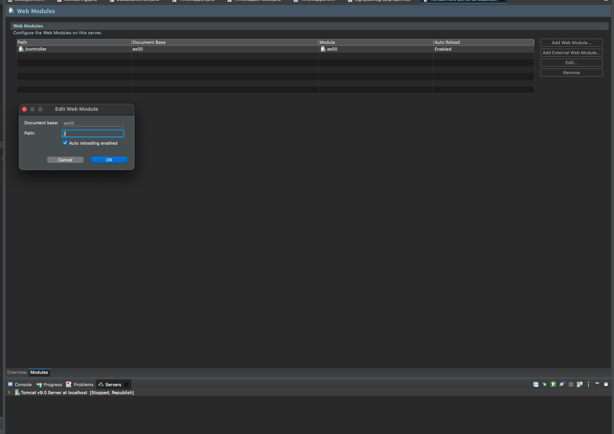

# 스프링 MVC 기본 설정

- 참고 : <https://spring.io/projects>
- 스프링 MVC는 스프링의 서브 프로젝트 중 하나.
- `스프링 코어` 프레임워크에 여러 서브 프로젝트를 결합할 수 있는 형태.
- 스프링 기능 중, MVC에 대한 설정을 하는 것이 'servlet-context.xml' 또는 'ServletConfig.class'.

- XML 설정을 이용할 지, JAVA 설정을 이용할지 결정하기
- JAVA 설정을 이용할 경우 pom.xml 에서 아래와 같이 추가하고, servlet-context.xml, root-context.xml, web.xml, spring 폴더는 삭제한다.
- XML 설정을 이용할 경우, 변경사항 없이 시작한다.

```xml
<plugin>
    <groupId>org.apache.maven.plugins</groupId>
    <artifactId>maven-war-plugin</artifactId>
    <version>3.2.0</version>
    <configuration>
        <failOnMissingWebXml>false</failOnMissingWebXml>
    </configuration>
</plugin>
```

## <font color='blue'>1. JAVA 설정 - RootConfig.java</font>

1. `src/java/main` 폴더 하위에 `org.example.config` 패키지 생성
2. `RootConfig.java`  파일 생성 : 이전에 작업한 내용은 주석처리하고 기본 설정만 살려두었다.

- RootConfig.java
```java
	package org.example.config;
	
	// import javax.sql.DataSource;
	// import org.apache.ibatis.session.SqlSessionFactory;
	// import org.mybatis.spring.SqlSessionFactoryBean;
	// import org.mybatis.spring.annotation.MapperScan;
	// import org.springframework.context.annotation.Bean;
	// import org.springframework.context.annotation.ComponentScan;
	import org.springframework.context.annotation.Configuration;
	
	import com.zaxxer.hikari.HikariConfig;
	import com.zaxxer.hikari.HikariDataSource;
	
	@Configuration
	// @ComponentScan(basePackages = {"org.example.sample"})
	// @MapperScan(basePackages = {"org.example.mapper"})
	public class RootConfig {
	
		// @Bean
		// public DataSource dataSource() {
		// 	HikariConfig config = new HikariConfig();
		// 	config.setDriverClassName("net.sf.log4jdbc.sql.jdbcapi.DriverSpy");
		// 	config.setJdbcUrl("jdbc:log4jdbc:mysql://localhost:3306/testDb");
		// 	//config.setJdbcUrl("jdbc:mysql://localhost:3306/testDb");
		// 	config.setUsername("book_ex");
		// 	config.setPassword("Tpdlfdl3278!");
		// 	config.addDataSourceProperty("serverTimezone", "UTC");
		// 	config.addDataSourceProperty("cachePrepStmts", "true");
		// 	config.addDataSourceProperty("prepStmtCacheSize", "250");
		// 	config.addDataSourceProperty("prepStmtCacheSqlLimit", "2048");
	
		// 	HikariDataSource ds = new HikariDataSource(config);
		// 	return ds;
		// }
		
		// @Bean
		// public SqlSessionFactory sqlSessionFactory() throws Exception {
		// 	SqlSessionFactoryBean sqlSessionFactory = new SqlSessionFactoryBean();
		// 	sqlSessionFactory.setDataSource(dataSource());
		// 	return (SqlSessionFactory) sqlSessionFactory.getObject();
		// }
	}
```
## <font color='blue'>2. JAVA 설정 - ServletConfig.java</font>

- `@EnableWebMvc` 어노테이션을 붙임으로 MVC를 설정할 수 있다.
- `@ComponentScan` 도 ServletConfig 에서 할 수 있다.

- ServletConfig.java

```java
package org.example.config;

import org.springframework.context.annotation.ComponentScan;
import org.springframework.web.servlet.config.annotation.EnableWebMvc;
import org.springframework.web.servlet.config.annotation.ResourceHandlerRegistry;
import org.springframework.web.servlet.config.annotation.ViewResolverRegistry;
import org.springframework.web.servlet.config.annotation.WebMvcConfigurer;
import org.springframework.web.servlet.view.InternalResourceViewResolver;
import org.springframework.web.servlet.view.JstlView;

@EnableWebMvc
@ComponentScan(basePackages = {"org.example.controller"})
public class ServletConfig implements WebMvcConfigurer {

	@Override
	public void configureViewResolvers(ViewResolverRegistry registry) {
		// TODO Auto-generated method stub
		InternalResourceViewResolver bean = new InternalResourceViewResolver();
		bean.setViewClass(JstlView.class);
		bean.setPrefix("/WEB-INF/views/");
		bean.setSuffix(".jsp");
		registry.viewResolver(bean);
	}
	
	
	@Override
	public void addResourceHandlers(ResourceHandlerRegistry registry) {
		// TODO Auto-generated method stub
		registry.addResourceHandler("/resources/**").addResourceLocations("/resources/");
	}
}

```

## <font color='blue'>3. JAVA 설정 - WebConfig.java</font>
> `AbstractAnnotationConfigDispatcherServletInitializer` 상속    
> `web.xml` 설정을 대체하는 java 파일   
> `org.example.config` 패키지 하위에 생성    
> `getRootConfigClasses()` 함수에 `RootConfig.class` 파일을 맵핑해준다.    
> `getServletConfigClasses()` 함수에 `ServletConfig.class` 파일을 맵핑해 준다.    
> `getServletMappings()` 함수에 Context-Root 인 "/" 를 반환하도록 한다.     

- WebConfig.java

```java
package org.example.config;

import org.springframework.web.servlet.support.AbstractAnnotationConfigDispatcherServletInitializer;

public class WebConfig extends
AbstractAnnotationConfigDispatcherServletInitializer {

	@Override
	protected Class<?>[] getRootConfigClasses() {
		// TODO Auto-generated method stub
		return new Class[] {RootConfig.class};
	}

	@Override
	protected Class<?>[] getServletConfigClasses() {
		// TODO Auto-generated method stub
		return new Class[] {ServletConfig.class};
	}

	@Override
	protected String[] getServletMappings() {
		// TODO Auto-generated method stub
		return new String[] {"/"};
	}

}
```

## <font color='blue'>4. JAVA 설정 - 확인</font>
- Tomcat 서버의 Path를 '/' 로 변경한다.


- Tomcat 서버를 Start 한다.
- 웹브라우저에서 `http://localhost:8080`을 호출 시, "Hello, World!" 가 정상적으로 보여진다.
 