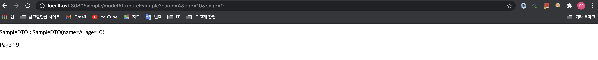
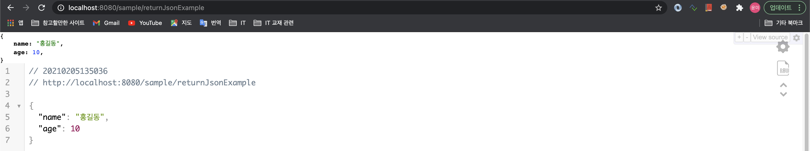
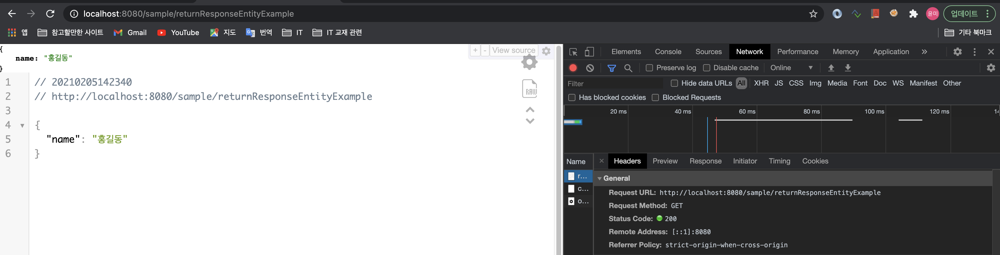
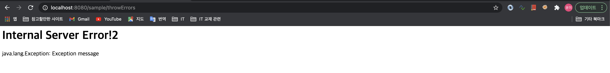
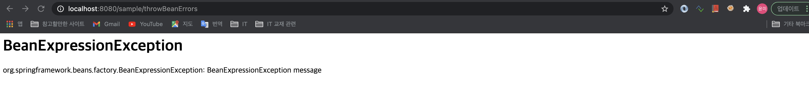
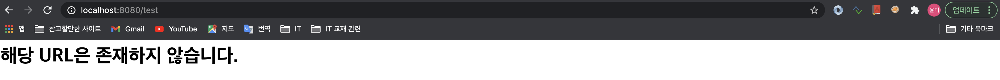

# 스프링 MVC의 Controller

## <font color='blue'>1. @Controller - 요청받을 준비하기</font>

- ComponentScan 에서 조사 할 수 있도록 해주는 어노테이션으로, 스프링이 관리 할 수 있는 Bean 으로 등록해 주는 어노테이션.
- Controller 클래스의 선언부에 @RequestMapping 과 같이 자주 사용함.

    <span style='background-color:#b5d6f7; display:inline-block; width:100%;'>예제</span>       
    . ServletConfig.java - ComponentScan 에 controller 소속된 패키지 추가    

    ```java
    package org.example.config;

    import org.springframework.context.annotation.ComponentScan;
    import org.springframework.web.servlet.config.annotation.EnableWebMvc;
    import org.springframework.web.servlet.config.annotation.ResourceHandlerRegistry;
    import org.springframework.web.servlet.config.annotation.ViewResolverRegistry;
    import org.springframework.web.servlet.config.annotation.WebMvcConfigurer;
    import org.springframework.web.servlet.view.InternalResourceViewResolver;
    import org.springframework.web.servlet.view.JstlView;

    @EnableWebMvc
    @ComponentScan(basePackages = {"org.example.controller"})
    public class ServletConfig implements WebMvcConfigurer {
        // 생략
    ```


    . SampleController.java - controller 작성

    ```java
    package org.example.controller;

    import org.springframework.stereotype.Controller;
    import org.springframework.web.bind.annotation.RequestMapping;

    @Controller
    @RequestMapping("/sample/*")
    public class SampleController {
    // 코드작성
    }
    ```

## <font color='blue'>2. 요청받을 URL 설정하기 - @RequestMapping, @GetMapping, @PostMapping</font>
- `@RequestMapping`: 해당 객체의 URL을 설정하는 기능을 함. 
- 클래스와 메소드의 선언부에 쓰임.
- `@GetMapping`: @RequestMapping의 method 속성이 GET 인 것의 단축표현
- `@PostMapping`: @RequestMapping의 method 속성이 POST 인 것의 단축표현

    . 예제       

    ```java
    @Controller
    @RequestMapping("/sample/*")
    @Log4j
    public class SampleController {

        @RequestMapping(value="", method = {RequestMethod.GET, RequestMethod.POST})
        public void basic() {
            log.info("basic...............");
        }
        
        @GetMapping("/get")
        public void basicGet() {
            log.info("basic get............");
        }
        
        @PostMapping("/post")
        public void basicPost() {
            log.info("basic post............");
        }
    }
    ```

## <font color='blue'>3.파라미터 받기 - DTO, @RequestParam, DTOList, @DateTimeFormat</font>

**<font color='green' style='font-size:large;'>1-1. VO, DTO 객체 파라미터</font>**   
- DTO 객체의 속성들은 별도의 처리 없이 파라미터를 받고 화면에 전달하는 것 까지 가능하다.
- DTO 가 될 수 있는 자격은 `Bean`의 자격을 갖춘 (인자가 없는 생성자, 게터/세터가 있어야 함) 객체여야 한다.

    <span style='background-color:#b5d6f7; display:inline-block; width:100%;'>예제</span>         
    . org.example.domain 패키지 > SampleDTO.java      
    
    ```java
    package org.example.domain;
    import lombok.Data;

    @Data
    public class SampleDTO {

        private String name;
        private int age;
    }
    ```

    . org.example.controller.SampleController.java       
    . 호출 시, `http://localhost:8080/sample/dto?name="A"&age=10` 라고 호출하면, SampleDTO 객체로 받고, 화면으로 전달도 가능하다.    

    ```java
    @Controller
    @RequestMapping("/sample/*")
    @Log4j
    public class SampleController {
        // 상단 생략
        @GetMapping("dto")
        public void getDtoExample(SampleDTO dto) {
            log.info("name:" + dto.getName());  // name:A
            log.info("age:" + dto.getAge());    // age:10
        }
    }
    ```

--------------------------------------------------------------------------------------
**<font color='green' style='font-size:large;'>1-2. @RequestParam </font>**     
- 전달된 파라미터와 controller 내에서 사용할 파라미터의 변수명이 다를 경우 유용하게 사용된다.

    <span style='background-color:#b5d6f7; display:inline-block; width:100%;'>예제</span>    

    ```java
    @Controller
    @RequestMapping("/sample/*")
    @Log4j
    public class SampleController {
        // 상단 생략
        @GetMapping("/requestparam")
        public void getRequestParamExample(@RequestParam("name") String myName) {
            log.info("name:" + myName); 	// name: A
        }
    }
    ```

    . `http://localhost:8080/requestparam?name=A` 로 호출 시, "name:A" 가 출력된다. 

-------------------------------------------------------------------------------------------
**<font color='green' style='font-size:large;'>1-3. 리스트, 배열 파라미터 처리하기</font>**
- 동일한 이름의 파라미터가 여러개 전달 될 때, `ArrayList<>` 나 `배열` 객체로 받을 수 있다.

    <span style='background-color:#b5d6f7; display:inline-block; width:100%;padding:5px;'>예제</span>    
    . `http://localhost:8080/sample/list?ids=1&ids=2&ids=3` 처럼 ids 라는 파라미터가 여러개 전달 되었다고 가정하자.   

    ```java
    @Controller
    @RequestMapping("/sample/*")
    @Log4j
    public class SampleController {
        // 상단 생략

        @GetMapping("/list")
        public void getListParameterExample(@RequestParam("ids") ArrayList<String> ids) {
            log.info("List ids:"+ids);
        }
        // 출력] INFO : org.example.controller.SampleController - List ids:[1, 2, 3]

        @GetMapping("/array")
        public void getArrayParameterExample(@RequestParam("ids") String[] ids) {
            log.info("Array ids:"+Arrays.deepToString(ids));
        }
        // 출력] INFO : org.example.controller.SampleController - Array ids:[1, 2, 3]
    }
    ```

-------------------------------------------------------------------------------------------
**<font color='green' style='font-size:large;'>1-3. DTO객체 리스트 처리하기</font>**
- 동일한 이름의 파라미터가 여러개 전달 될 때, `dtoList.java` 객체를 생성하여 받을 수 있다.

    <span style='background-color:#b5d6f7; display:inline-block; width:100%;padding:5px;'>예제</span>    
    . `http://localhost:8080/sample/dtolist?list%5B0%5D.name=A&list%5B0%5D.age=10&list%5B1%5D.name=B&list%5B1%5D.age=20` 처럼 SampleDTO 객체 파라미터가 여러개 전달 되었다고 가정하자.(encoding된 url.)  

    ( http://localhost:8080/sample/dtolist?list[0].name=A&list[0].age=10&list[1].name=B&list[1].age=20 과 같음. )

    . SampleDTOList.java   
    
    ```java
    package org.example.domain;
    @Data
    public class SampleDTOList {

        private List<SampleDTO> list;
        
        public SampleDTOList() {
            list = new ArrayList<>();
        }
    }
    ```

    . SampleController.java

    ```java
    @Controller
    @RequestMapping("/sample/*")
    @Log4j
    public class SampleController {
        @GetMapping("/dtolist")
        public void getDtoListExample(SampleDTOList list) {
            log.info("dto list:" + list);
            // 출력 : INFO : org.example.controller.SampleController - dto list:SampleDTOList(list=[SampleDTO(name=A, age=10), SampleDTO(name=B, age=20)])
        }
    }
    ```

-------------------------------------------------------------------------------------------

**<font color='green' style='font-size:large;'>1-4. 날짜 포맷의 파라미터를 date 타입으로 받기.</font>**
- DTO 의 `Date` 자료형으로 된 속성에 `@DateTimeFormat(pattern="yyyy/mm/dd")` 만 붙이면, 파라미터를 Date 형으로 받을 수 있다.

    <span style='background-color:#b5d6f7; display:inline-block; width:100%;padding:5px;'>예제</span> 

    . TodoDTO.java   

    ```java
    @Data
    public class TodoDTO {

        @DateTimeFormat(pattern="yyyy/mm/dd")
        private Date dueDate;
    }
    ```

    . SampleController.java

    ```java
	@GetMapping("/date")
	public void getDateParameterExample(TodoDTO dto) {
		log.info("date:" + dto.getDueDate());
	
		//[요청] http://localhost:8080/sample/date?dueDate=2020/01/01
		//[출력] INFO : org.example.controller.SampleController - date:Wed Jan 01 00:01:00 KST 2020
	}
    ```

## <font color='blue'>4. 화면으로 데이터 전달하기 - DTO, Model 객체, @ModelAttribute, RedirectAttributes</font>
**<font color='green' style='font-size:large;'>4-1. Model 객체</font>**
- 메소드의 파라미터로 선언하면, 자동으로 객체가 생성된다.
- controller 에서 새롭게 처리한 데이터를 화면으로 전달할 때 사용한다.

    <span style='background-color:#b5d6f7; display:inline-block; width:100%;padding:5px;'>예제</span> 

    . SampleController.java    

    ```java
        @GetMapping("/modelExample")
        public void modelExample(Model model) {
            model.addAttribute("test", "Success!!");
        }
    ```
    . modelExample.jsp    

    ```jsp
    <%@ taglib uri="http://java.sun.com/jsp/jstl/core" prefix="c" %>
    <%@ page session="false" %>
    <html>
    <body>
    <P>  ${test} </P>
    </body>
    </html>
    ```

-------------------------------------------

**<font color='green' style='font-size:large;'>4-2. @ModelAttribute 애노테이션</font>**
- DTO 의 경우, 자동으로 화면으로 전달 된다. ( 첫 대문자가 소문자로 바뀌어 전달됨. )
- 그러나, 전달 받은 기본 자료형 (int, string...) 의 경우, 별도의 처리를 하지않으면 자동으로 화면으로 전달되지 않는다.
- @ModelAttribute 어노테이션은 기본자료형도 자동으로 화면까지 전달 해주는 기능을 한다.

    <span style='background-color:#b5d6f7; display:inline-block; width:100%;padding:5px;'>예제</span> 

    . SampleDTO.java

    ```java
    @Data
    public class SampleDTO {
        private String name;
        private int age;
    }
    ```

    . SampleController.java

    ```java
	@GetMapping("/modelAttributeExample")
	public void modelAttributeExample(SampleDTO dto, @ModelAttribute("page") int page) {	
	}
    ```

    . modelAttributeExample.jsp

    ```jsp
    <%@ page language="java" contentType="text/html; charset=UTF-8"
        pageEncoding="UTF-8"%>
    <!DOCTYPE html>
    <html>
    <head>
    <meta charset="UTF-8">
    <title>Insert title here</title>
    </head>
    <body>
    <p>SampleDTO : ${sampleDTO} </p>
    <p>Page : ${page}</p>
    </body>
    </html>
    ```

    . 결과화면
    

--------------------------------------------------------------------------------

**<font color='green' style='font-size:large;'>4-3. RedirectAttributes</font>**
- 일회성으로 데이터를 전달하는 용도.

```java
// Todo.
```

## <font color='blue'>5. Controller의 반환 타입 - DTO, void, string, ResponseEntity, Model</font>
**<font color='green' style='font-size:large;'>5-1. void 타입</font>**
- 해당 URL 그대로 jsp 이름으로 사용

    ```java
    @GetMapping("voidSample")
    public void voidSample(){
    }
    ```

    -> voidSample.jsp 응답함.

----------------------------------------------------------------------

**<font color='green' style='font-size:large;'>5-2. String 타입</font>**
- jsp 이름을 리턴함.
- 특별한 키워드를 붙여서 사용할 수 있음.
    - `"redirect:home"`
    - `forward:home"`


    ```java
    @Controller
    public class HomeController {

        @GetMapping("/")
        public String home(Locale locale, Model model) {
            Date date = new Date();
            DateFormat dateFormat = DateFormat.getDateTimeInstance(DateFormat.LONG, DateFormat.LONG, locale);
            String formattedDate = dateFormat.format(date);
            model.addAttribute("serverTime", formattedDate );
            return "home";
        }
    }
    ```

    -> home.jsp 로 응답함.


----------------------------------------------------------------------

**<font color='green' style='font-size:large;'>5-3. 객체 타입 (Json 변환)</font>**
- VO나 DTO 타입등 객체 타입을 리턴 할 수 있는데, 이 경우 `JSON 데이터를 만들어 내는 용도`로 사용함.
- HttpResponse 객체를 전달함으로 화면으로 전달하지 않음. ajax와 함께 쓰임

1. JSON 데이터로 변환하는 준비 : `jackson-databind`

    ```xml
    <!-- https://mvnrepository.com/artifact/com.fasterxml.jackson.core/jackson-databind -->
    <dependency>
        <groupId>com.fasterxml.jackson.core</groupId>
        <artifactId>jackson-databind</artifactId>
        <version>2.11.3</version>
    </dependency>
    ```
2. 메소드의 리턴타입에 @ResponseBody 어노테이션 붙이고 객체 리턴하기

    ```java
    @GetMapping("returnJsonExample")
	public @ResponseBody SampleDTO returnJsonExample() {
		
		SampleDTO dto = new SampleDTO();
		dto.setName("홍길동");
		dto.setAge(10);
		
		return dto;
	}
    ```
3. 실행 확인 : `http://localhost:8080/returnJsonExample`

    

----------------------------------------------------------------------

**<font color='green' style='font-size:large;'>5-4. ResponseEntity 타입</font>**
- HTTP의 `Header` 정보나 데이터를 전달하기 위해 사용
- HttpResponse 객체를 전달함으로 화면으로 전달하지 않음. ajax와 함께 쓰임

1. ResponseEntity 리턴 예제

    ```java
    @GetMapping("returnResponseEntityExample")
    public ResponseEntity<String> returnResponseEntityExample(){
        
        String msg = "{\"name\":\"홍길동\"}";
        HttpHeaders header = new HttpHeaders();
        header.add("Content-Type", "application/json;charset=UTF-8");
        return new ResponseEntity<>(msg, header, HttpStatus.OK);
    }
    ```
2. 실행화면

    

----------------------------------------------------------------------

## <font color='blue'>6. 파일 업로드 (servlet3.0)</font>
- Servlet3.0 이상에서는 기본적으로 파일업로드 기능 제공.
- Servlet3.0 이전 버전에서는 commons-fileupload, cos.jar 등의 라이브러리가 필요함
- 이번 예제는, `commons-fileupload` 라이브러리를 사용하도록 하겠음.

1. commons-fileupload 라이브러리 설치

    ```xml
		 <!-- https://mvnrepository.com/artifact/commons-fileupload/commons-fileupload -->
		<dependency>
		    <groupId>commons-fileupload</groupId>
		    <artifactId>commons-fileupload</artifactId>
		    <version>1.3.3</version>
		</dependency>
    ```
2. 파일 업로드 할 임시 폴더 생성 : /Users/kim-yunmi/fileupload/tmp
3. servlet-context.xml 또는 ServletConfig.java 에 `MultipartResolver` (파일업로드)에 대한 설정하기
    - ServletConfig.java

        ```java
        package org.example.config;
        @EnableWebMvc
        @ComponentScan(basePackages = {"org.example.controller"})
        public class ServletConfig implements WebMvcConfigurer {
            //  상단 생략.

            @Bean(name="multipartResolver")
            public CommonsMultipartResolver getResolver() throws IOException{
            
                CommonsMultipartResolver resolver = new CommonsMultipartResolver();    
                // 10MB
                resolver.setMaxUploadSize(1024 * 1024 * 10);
                // 2MB
                resolver.setMaxUploadSizePerFile(1024 * 1024 * 2);
                // 임시 폴더 
                resolver.setUploadTempDir(new FileSystemResource("/Users/kim-yunmi/fileupload/tmp"));
                resolver.setD   efaultEncoding("UTF-8");
                return resolver;
            } 
        }
        ```

    - servlet-context.xml (`bean id는 꼭 "multipartResolver" 여야 함.`)
        
        ```xml
        <beans:bean id="multipartResolver" class="org.springframework.web.multipart.commons.CommonsMultipartResolver">
            <beans:property name="defaultEncoding" value="utf-8"></beans:property>
            <beans:property name="maxUploadSize" value="104857560"></beans:property>
            <beans:property name="maxUploadSizePerFile" value="2097152"></beans:property>
            <beans:property name="uploadTempDir" value="file:/Users/kim-yunmi/fileupload/tmp"></beans:property>
            <beans:property name="maxInMemorySize" value="10485756"></beans:property>
        </beans:bean>
        ```
    - uploadTempDir 의 경로는, URL 형식으로 하여야 하므로 'file:' 로 시작함
4. SampleController.java : 파일 업로드 화면으로 이동할 GET 방식의 Controller

    ```java
    	@GetMapping("/uploadExample")
	    public void uploadExampleGet() {	
	}
    ```

5. uploadExample.jsp : 파일 업로드 화면

    ```jsp
    <%@ page language="java" contentType="text/html; charset=UTF-8"
        pageEncoding="UTF-8"%>
    <!DOCTYPE html>
    <html>
    <head>
    <meta charset="UTF-8">
    <title>fileUpload Example</title>
    </head>
    <body>
        <form action="uploadExample" method="post" enctype="multipart/form-data">
            <div><input type="file" name="files"></div>
            <div><input type="file" name="files"></div>
            <div><input type="file" name="files"></div>
            <div><input type="file" name="files"></div>
            <div><input type="file" name="files"></div>
            <div><input type="submit"></div>
        </form>
    </body>
    </html>
    ```

6. SampleController.java : 파일 업로드를 처리할 Post 방식의 컨트롤러

    ```java
    // 파일업로드 처리 
	@PostMapping("/uploadExample")
	public void uploadExamplePost(ArrayList<MultipartFile> files) {
		files.forEach(file -> {
			log.info("-------------------");
			log.info("fileName:" + file.getOriginalFilename());
			log.info("size:" + file.getSize());
            // 파일을 업로드 처리할 코드 작성. (여기서는 넘어감.)
		});
	}
    ```

## <font color='blue'>7. Controller의 예외처리 - @ControllerAdvice, @ExceptionHandler</font>
- @ExceptionHandler와 @ControllerAdvice 이용한 처리
- @ResponseEntity를 이용한 예외 메시지 전달

1. `org.example.exception` 패키지 생성한다.
2. Java Configuration일 경우, `ServletConfig.java` 의 @ComponentScan 에 "org.example.exception" 패키지를 추가한다.
3. XML 설정일 경우, `servlet-context.xml` 에 `<context:component-scan base-package="org.example.exception"/>` 을 추가한다.

**<font color='green' style='font-size:large;'>7-1. 서버에러 (500에러) 처리</font>**
1. `CommonExceptionAdvice.java` : 예외 처리 객체 생성
    
    ```java
    @ControllerAdvice
    @Log4j
    public class CommonExceptionAdvice {
        
        @ExceptionHandler(Exception.class)
        public String except(Exception ex, Model model) {
            
            log.error("Exception:"+ex.getMessage());
            model.addAttribute("exception", ex);
            
            return "error/error_page";
        }
        
        @ExceptionHandler(BeanExpressionException.class)
        public String beanExcept(BeanExpressionException ex, Model model) {
            
            log.error("BeanExpressionException:"+ex.getMessage());
            model.addAttribute("exception", ex);
            
            return "error/bean_error_page";
        }   
    }
    ```
    - 클래스에 @ControllerAdvice 를 붙인다.
    - 메소드에 @ExceptionHandler 를 붙이고, () 안에 처리할 Exception 클래스를 넣는다. 이 때 `Exception.class` 대신 구체적인 예외 클래스를 지정할 수 있다.

2. `error/error_page.jsp`, `error/bean_error_page.jsp` : 예외정보를 보여줄 화면 작성 (WEB-INF/views/error 폴더 하위에 jsp를 작성한다. except() 메소드가 "error/error_page" 를 리턴하였기 때문이다.)

    ```jsp
    <%@ taglib uri="http://java.sun.com/jsp/jstl/core" prefix="c" %>
    <%@ page session="false" %>
    <html>
    <head>
        <title>Internal Server Error</title>
    </head>
    <body>
    <h1>
        Internal Server Error!
    </h1>
    ${exception}
    </body>
    </html>
    ```

3. `SampleController.java` : 예외처리 테스트를 위해서, 강제로 예외를 던지는 controller를 작성한다.

    ```java
    // 에러발생 테스트 1
	@GetMapping("/throwErrors")
	public void exceptionTest() throws Exception {
		throw new Exception("Exception message");
	}
    
    // 에러발생 테스트 2
	@GetMapping("/throwBeanErrors")
	public void beanExceptionTest() throws BeanExpressionException {
		throw new BeanExpressionException("BeanExpressionException message");
	}
    ```

4. `http://localhost:8080/sample/throwErrors` 를 호출하면, except() 에서 예외를 처리하고 error_page.jsp 예외화면이 발생한다.

    

5. `http://localhost:8080/sample/throwBeanErrors` 를 호출하면, beanExcept() 에서 예외를 처리하고 bean_error_page.jsp 예외화면이 발생한다.

    

-----------------------

**<font color='green' style='font-size:large;'>7-2. 404 에러 처리</font>**
1. `web.xml` 또는 `WebConfig.java` 에 404 에러처리를 위한 설정을 할 수 있다. (Servlet 3.0 이상)

    . web.xml   
    ```xml
    <servlet>
    <!-- 상단생략 -->
    <init-param>
        <param-name>throwExceptionIfNoHandlerFound</param-name>
        <param-value>true</param-value>
    </init-param>
    <load-on-startup>1</load-on-startup>
    </servlet>
    ```
    . WebConfig.java   
    ```java
    public class WebConfig extends
    AbstractAnnotationConfigDispatcherServletInitializer {
    // 상단 생략
        @Override
        protected void customizeRegistration(Dynamic registration) {
            // TODO Auto-generated method stub
            registration.setInitParameter("throwExceptionIfNoHandlerFound", "true");
        }
    }
    ```

2. `CommonExceptionAdvice.java` 클래스에 404에러 처리를 위한 메소드를 작성한다.
    
    ```java
    @ControllerAdvice
    @Log4j
    public class CommonExceptionAdvice {
        
        // 상단 생략
        @ExceptionHandler(NoHandlerFoundException.class)
        @ResponseStatus(HttpStatus.NOT_FOUND)
        public String handle404(NoHandlerFoundException ex) {
            
            return "error/custom404";
        }
    }
    ```
3. `error/custom404.jsp` : 404에러를 보여줄 화면을 작성한다.
    
    ```jsp
    <%@ taglib uri="http://java.sun.com/jsp/jstl/core" prefix="c" %>
    <%@ page language="java" contentType="text/html; charset=UTF-8" pageEncoding="UTF-8" session="false" %>
    <html>
    <head>
        <title>Page Not Found!</title>
        <meta http-equiv="Content-Type" content="text/html; charset=UTF-8">
    </head>
    <body>
    <h1>
        해당 URL은 존재하지 않습니다.
    </h1>
    </body>
    </html>
    ```

    - `<%@ page language="java" contentType="text/html; charset=UTF-8" pageEncoding="UTF-8" session="false" %>` 를 작성해야 한글이 깨지지 않는다.

4. 웹 브라우저에 `http://localhost:8080/test` 를 호출하여 404 에러처리를 확인한다.<br/>(/sample/** 의 패턴을 사용하면 SampleController 가 동작해 버리므로, 404 확인을 위해서는 사용하면 안됨.)

    