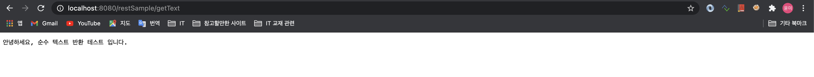
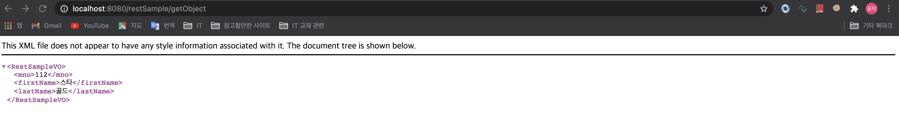
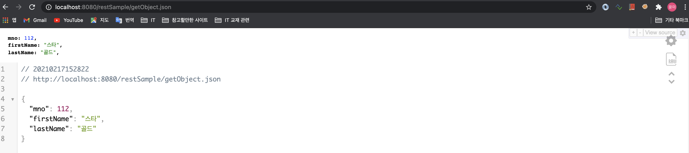
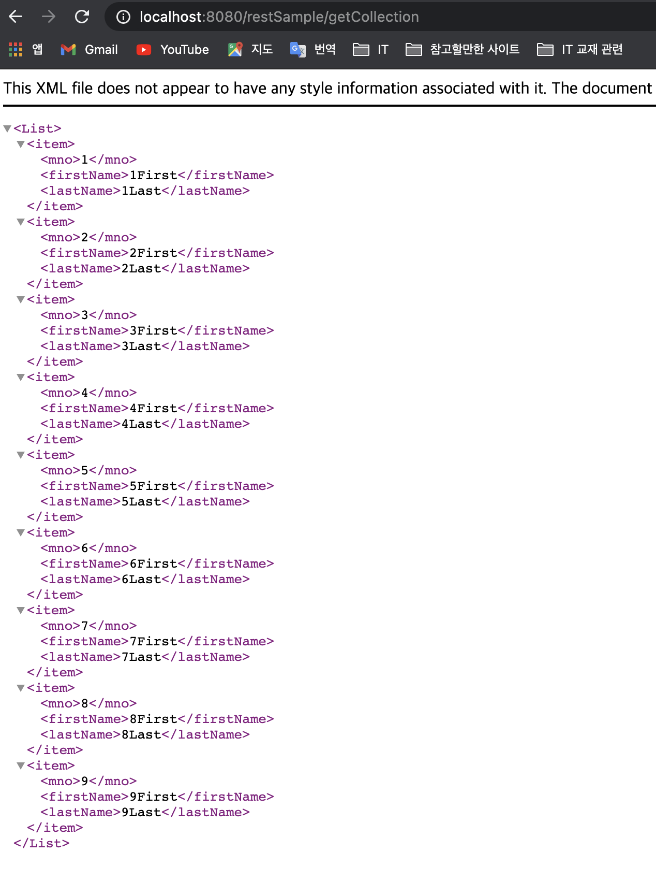
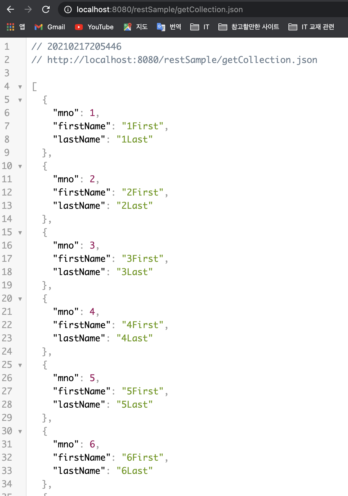
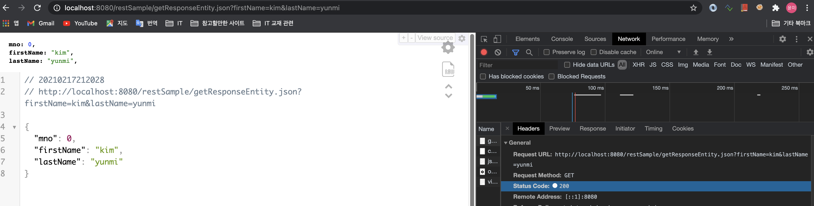
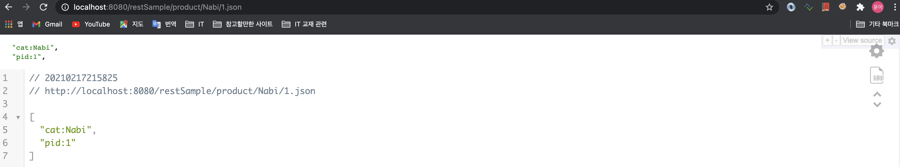
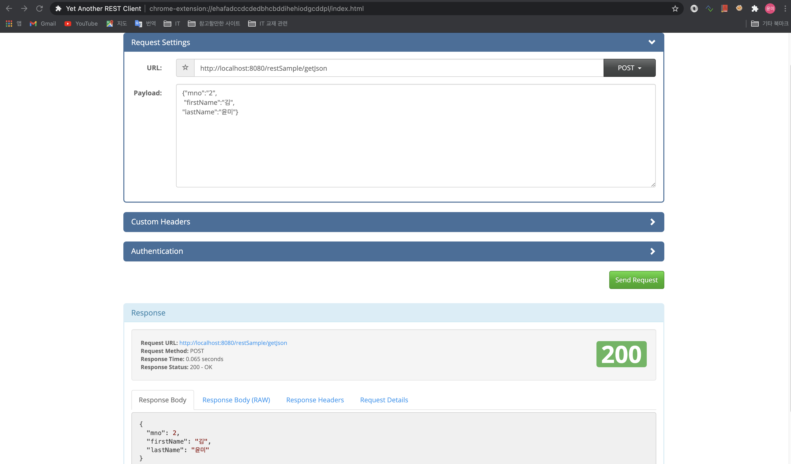

# REST 방식

- **REST** : 'Representational State Transfer', URI가 하나의 리소스를 대표하도록 설계 하는 방식
- **REST 방식을 위해 필요한 어노테이션**

1. @RestController : Controller 가 Rest 방식임을 명시함
2. @ResponseBody : 뷰가 아닌 데이터 자체를 전달하기 위한 어노테이션
3. @PathVariable : url 경로의 값을 파라미터처럼 사용하기 위한 어노테이션
4. @CrossOrigin : Ajax의 크로스 도메인 문제를 해결해 주는 어노테이션
5. @RequestBody : 뷰로부터 전달받은 Json 을 객체로 변환해 주는 어노테이션

## <font color='blue'>1. @RestController</font>
- 뷰로 전달하는 방식이 아니라, 데이터 자체를 전송함
- @Controller에서, @ResponseBody를 이용한 것과 동일한 결과임
- @RestController는 리턴타입으로 사용자 객체를 이용할 수 있고, 이를 Json이나 Xml로 자동으로 처리 가능함

1. Json  데이터를 처리하기 위한 `jackson-databind` 라이브러리를 pom.xml 에 추가
2. Xml 데이터 처리를 위한 `jackson-dataformat-xml` 라이브러리를 pom.xml 에 추가
3. java 객체를 json 으로 변경하기 위한 `gson` 라이브러리를 pom.xml 에 추가

```xml
<!-- https://mvnrepository.com/artifact/com.fasterxml.jackson.dataformat/jackson-dataformat-xml -->
<dependency>
    <groupId>com.fasterxml.jackson.dataformat</groupId>
    <artifactId>jackson-dataformat-xml</artifactId>
    <version>2.12.1</version>
</dependency>

<!-- https://mvnrepository.com/artifact/com.fasterxml.jackson.core/jackson-databind -->
<dependency>
    <groupId>com.fasterxml.jackson.core</groupId>
    <artifactId>jackson-databind</artifactId>
    <version>2.12.1</version>
</dependency>

<!-- https://mvnrepository.com/artifact/com.google.code.gson/gson -->
<dependency>
    <groupId>com.google.code.gson</groupId>
    <artifactId>gson</artifactId>
    <version>2.8.5</version>
</dependency>

```

## <font color='blue'>2. @RestController 반환타입</font>

**<font color='green' style='font-size:large;'>2-1. 단순 문자열 반환</font>**
- 순수한 text 또는 Json, Xml 로 반환
- @GetMapping의 `produces` 속성에 `text/plain; charset=UTF-8` MIME 타입 명시
    ```java
	@GetMapping(value = "/getText", produces = "text/plain; charset=UTF-8")
	public String getText() {
		log.info("MIME TYPE:" + MediaType.APPLICATION_JSON_VALUE);
		return "안녕하세요, 순수 텍스트 반환 테스트 입니다.";
	}
    ```


**<font color='green' style='font-size:large;'>2-2. 객체 반환</font>**
- 객체 반환은, JSON이나 XML을 이용함
- produces 의 MIME 타입은, 생략이 가능하지만 명시적으로 선언하는 것이 좋음
    ```java
	@GetMapping(value = "/getObject", 
				produces = {MediaType.APPLICATION_JSON_VALUE,
							MediaType.APPLICATION_XML_VALUE} )
	public RestSampleVO getObject() {
		return new RestSampleVO(112, "스타", "골드");
	}
    ```

- 결과 1: http://localhost:8080/restSample/getObject 호출



- 결과 2: http://localhost:8080/restSample/getObject.json 호출



**<font color='green' style='font-size:large;'>2-3. 컬렉션 객체 반환</font>**
- 맵, 배열, 리스트등 전송 가능
- produces 명시 하지 않으면, 자동으로 xml 이나 json 으로 전송됨
    ```java
	@GetMapping(value="/getCollection",
			produces = {MediaType.APPLICATION_JSON_VALUE,
						MediaType.APPLICATION_XML_VALUE})
	public List<RestSampleVO> getCollection(){
		
		return IntStream.range(1, 10).mapToObj(i -> new RestSampleVO(i, i+"First", i+"Last")).collect(Collectors.toList());
	}
    ```
- 결과 1: http://localhost:8080/restSample/getCollection 호출

{: width="50%"}

- 결과 2: http://localhost:8080/restSample/getCollection.json 호출

{: width="50%"}


**<font color='green' style='font-size:large;'>2-4. ResponseEntity 타입 반환</font>**

1. `ResponseEntity`란?
- '데이터 + 헤더정보 + 상태정보'를 같이 전달하는 용도로 사용

2. ResponseEntity 생성자
- ResponseEntity(HttpStatus status)
- ResponseEntity(MultiValueMap<String, String> headers, HttpStatus status)
- ResponseEntity(T body, MultiValueMap<String, String> headers, HttpsStatus status)
- ResponseEntity(T body, MultiValueMap<String, String> headers, int rawStatus)

```java
	@GetMapping(value="/getResponseEntity", params= {"firstName", "lastName"})
	public ResponseEntity<RestSampleVO> getResponseEntity(String firstName, String lastName){
		
		RestSampleVO vo = new RestSampleVO(0, firstName, lastName);
		ResponseEntity<RestSampleVO> result = null;
		
		return result.status(HttpStatus.OK).body(vo);
	}
```

- 결과 1: http://localhost:8080/restSample/getResponseEntity.json?firstName=kim&lastName=yunmi 호출




## <font color='blue'>3. @RestController의 파라미터</font>

**<font color='green' style='font-size:large;'>3-1. @PathVariable</font>**
- url 경로를 파라미터처럼 사용할 때 사용한다.

```java
	@GetMapping("/product/{cat}/{pid}")
	public String[] getPath(@PathVariable("cat") String cat, @PathVariable("pid") Integer pid) {
		
		return new String[] {"cat:"+cat, "pid:"+pid};
	}
```

- 결과 1: http://localhost:8080/restSample/product/Nabi/1.json 호출



**<font color='green' style='font-size:large;'>3-2. @RequestBody</font>**
- json 으로 Controller에 전송된 데이터를 사용자 객체로 변환할 때 사용한다.
- body를 이용함으로 post 요청만 할 수 있다.
- 요청을 post 로 Json 데이터를 전송하고, 받을 때는 @RequestBody에 의해 RestSampleVO로 받는다.

```java
	@PostMapping("/getJson")
	public RestSampleVO getJsonToObj(@RequestBody RestSampleVO vo){
		return vo;
	}
```

- test 및 결과 확인 : test는 크롬 브라우저의 확장 프로그램 `REST Client`를 이용한다.



## <font color='blue'>4. Rest 방식의 TEST</font>

**<font color='green' style='font-size:large;'>4-1. Json 으로 테스트하기</font>**

- 3-2. @RequestBody 의 예제를 호출하는 테스트를 작성하였다.

```java
package org.example.controller;

import static org.springframework.test.web.servlet.request.MockMvcRequestBuilders.post;
import static org.springframework.test.web.servlet.result.MockMvcResultMatchers.status;

import org.example.domain.RestSampleVO;
import org.junit.Before;
import org.junit.Test;
import org.junit.runner.RunWith;
import org.springframework.beans.factory.annotation.Autowired;
import org.springframework.http.MediaType;
import org.springframework.test.context.ContextConfiguration;
import org.springframework.test.context.junit4.SpringJUnit4ClassRunner;
import org.springframework.test.context.web.WebAppConfiguration;
import org.springframework.test.web.servlet.MockMvc;
import org.springframework.test.web.servlet.MvcResult;
import org.springframework.test.web.servlet.ResultActions;
import org.springframework.test.web.servlet.setup.MockMvcBuilders;
import org.springframework.web.context.WebApplicationContext;

import com.google.gson.Gson;

import lombok.extern.log4j.Log4j;

@RunWith(SpringJUnit4ClassRunner.class)
@WebAppConfiguration
@ContextConfiguration({"file:src/main/webapp/WEB-INF/spring/appServlet/servlet-context.xml",
					   "file:src/main/webapp/WEB-INF/spring/root-context.xml"})
@Log4j
public class RestSampleControllerTest {

	@Autowired
	private WebApplicationContext ctx;
	
	private MockMvc mockMvc;
	
	@Before
	public void setup() {
		this.mockMvc = MockMvcBuilders.webAppContextSetup(ctx).build();
	}
	
	@Test
	public void testConvert() throws Exception{
		RestSampleVO vo = new RestSampleVO();
		vo.setMno(1);
		vo.setFirstName("김");
		vo.setLastName("라라");
		
		String jsonStr = new Gson().toJson(vo);
		
		log.info("jsonStr:" + jsonStr);
		
		mockMvc.perform(post("/restSample/getJson")
				.contentType(MediaType.APPLICATION_JSON)
				.content(jsonStr))
				.andExpect(status().is(200));
		
	}
}
```

**<font color='green' style='font-size:large;'>4-2. 기타도구 사용하기</font>**
- Tomcat을 구동한다면, Mac 이나 Linux는 `curl` 이용
- 크롬의 확장 프로그램인 `REST client` 이용