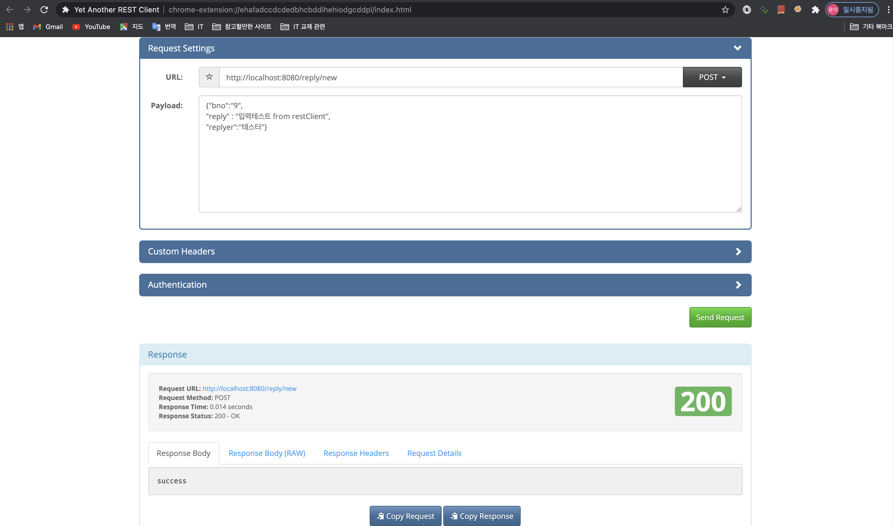
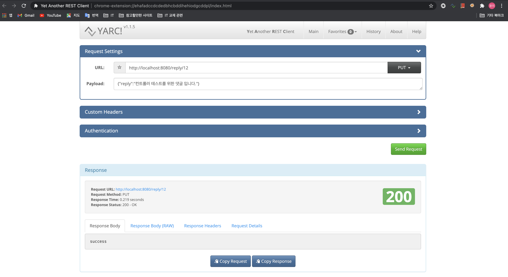
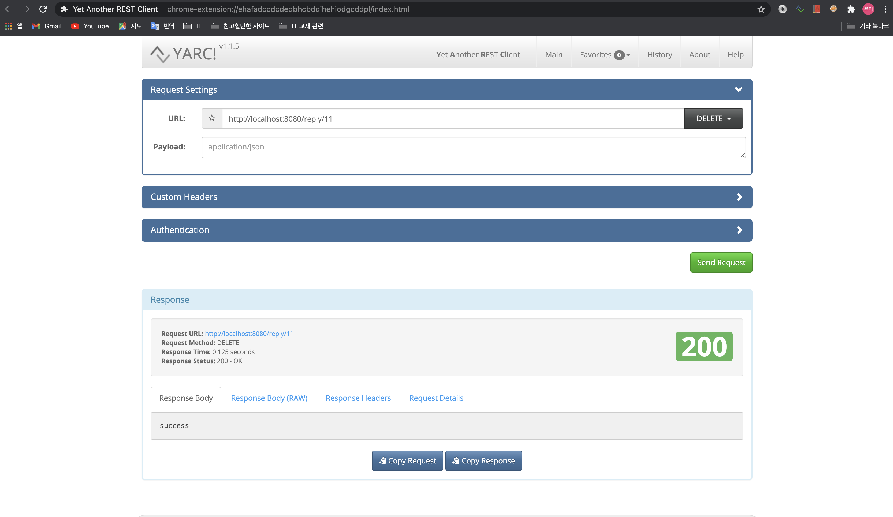
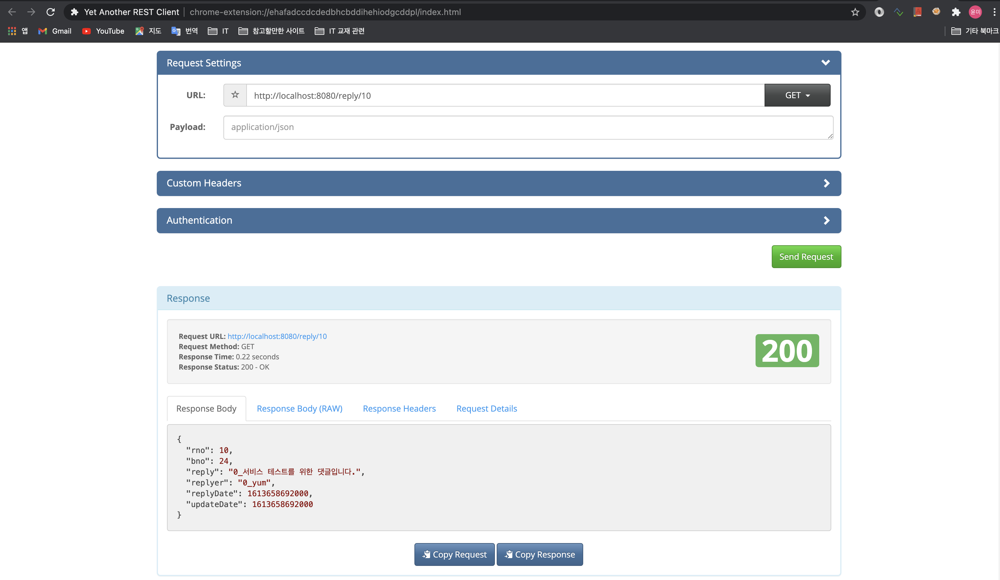
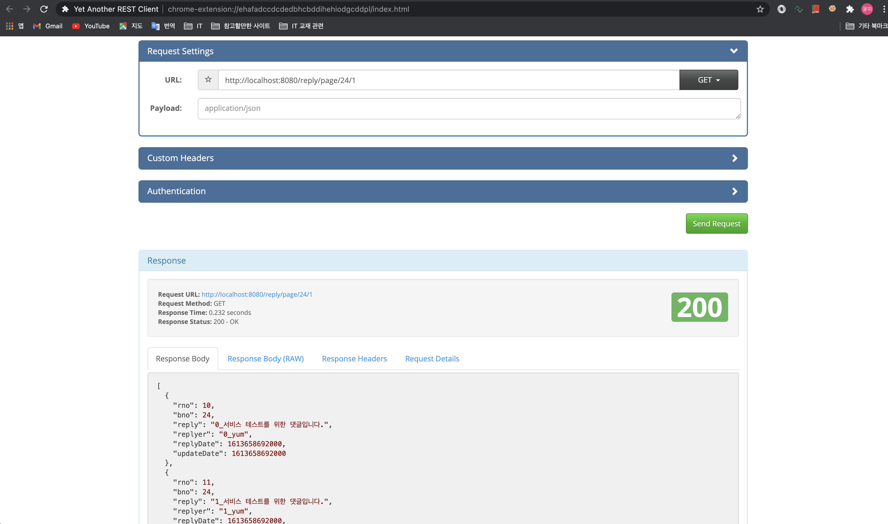

# Ajax 댓글 달기 예제

## <font color='blue'>1. 영속계층 개발</font>

**<font color='green' style='font-size:large;'>1-0. tbl_reply DB 테이블 생성</font>**

```sql
CREATE TABLE `tbl_reply` (
  `rno` int NOT NULL AUTO_INCREMENT,
  `bno` int NOT NULL,
  `reply` varchar(1000) NOT NULL,
  `replyer` varchar(50) NOT NULL,
  `replyDate` datetime DEFAULT CURRENT_TIMESTAMP,
  `updateDate` datetime DEFAULT CURRENT_TIMESTAMP,
  PRIMARY KEY (`rno`)
) 
```

**<font color='green' style='font-size:large;'>1-1. ReplyVO 클래스 생성</font>**

```java
package org.example.domain;
import java.util.Date;
import lombok.Data;

@Data
public class ReplyVO {
	private Long rno;
	private Long bno;
	
	private String reply;
	private String replyer;
	private Date replyDate;
	private Date updateDate;
}
```

**<font color='green' style='font-size:large;'>1-2. ReplyMapper 인터페이스와 XML 처리</font>**

- **Mapper 인터페이스 작성**   

    - `기억할 점! @Param으로 전달한 파라미터는, MyBatis 에서 #{} 형태로 사용할 수 있어서 여러개의 파라미터를 전달할 때 유용합니다.`


    ```java
    package org.example.mapper;

    import java.util.List;

    import org.apache.ibatis.annotations.Param;
    import org.example.domain.Criteria;
    import org.example.domain.ReplyVO;

    public interface ReplyMapper {

        public int insert(ReplyVO vo);
        
        public ReplyVO read(Long rno);
        
        //@Param으로 전달한 파라미터는 MyBatis 에서 #{} 형태로 사용할 수 있다.
        public List<ReplyVO> getListWithPage(@Param("cri") Criteria cri, @Param("bno") Long bno);
        
        public int delete(Long rno);

        public int update(ReplyVO vo);
    }
    ```

- **Mapper XML 작성**  

    ```xml
    <?xml version="1.0" encoding="UTF-8"?>
    <!DOCTYPE mapper
        PUBLIC "-//mybatis.org//DTD Mapper 3.0//EN"
        "http://mybatis.org/dtd/mybatis-3-mapper.dtd">

    <mapper namespace="org.example.mapper.ReplyMapper">	
        
        <insert id="insert">
            insert into tbl_reply (bno, reply, replyer)
            values (#{bno}, #{reply}, #{replyer})
        </insert>


        <select id="read" resultType="org.example.domain.ReplyVO">
            select * from tbl_reply 
            where rno = #{rno}
        </select>	
        
        
        <delete id="delete">
        delete from tbl_reply
        where rno = #{rno}
        </delete>
        
        
        <update id="update">
        update tbl_reply set
        reply = #{reply}
        ,updatedate = CURRENT_TIMESTAMP
        where rno = #{rno}
        </update>
        
        
        <select id="getListWithPage" resultType="org.example.domain.ReplyVO">
        select * from tbl_reply
        where bno = #{bno}
        limit #{cri.rowindex}, #{cri.amount}
        </select>
    </mapper>
    ```

**<font color='green' style='font-size:large;'>1-3. ReplyMapper 테스트</font>**
- `src/test/java` > `org.exxample.mapper` > ReplyMapperTest.java

```java
package org.example.mapper;

import java.util.stream.IntStream;

import org.example.domain.Criteria;
import org.example.domain.ReplyVO;
import org.junit.Test;
import org.junit.runner.RunWith;
import org.springframework.beans.factory.annotation.Autowired;
import org.springframework.test.context.ContextConfiguration;
import org.springframework.test.context.junit4.SpringJUnit4ClassRunner;

import lombok.Setter;
import lombok.extern.log4j.Log4j;

@RunWith(SpringJUnit4ClassRunner.class)
@ContextConfiguration("file:src/main/webapp/WEB-INF/spring/root-context.xml")
@Log4j
public class ReplyMapperTest {

	@Setter(onMethod = @__({@Autowired}))
	private ReplyMapper mapper;
	
	//@Test
	public void testMapper() {
		log.info(mapper);
	}
	
	//@Test
	public void testInsert() {
		IntStream.range(1, 10).forEach(i ->
		{
			ReplyVO vo = new ReplyVO();
			vo.setBno(9L);
			vo.setReply(i + "_이것은 테스트를 위한 댓글입니다.");
			vo.setReplyer(i +"_sera");
			mapper.insert(vo);
		});
	}
	
	//@Test
	public void testRead() {
		ReplyVO vo = mapper.read(1L);
		log.info(vo);
	}
	
//	@Test
	public void testDelete() {
		log.info("결과:" + (mapper.delete(1L)==1?"성공" : "실패"));
	}
	
//	@Test
	public void testUpdate() {
		
		ReplyVO vo = new ReplyVO();
		vo.setRno(2L);
		vo.setReply("2_이것은 업데이트 테스트를 위한 댓글입니다.");
		vo.setReplyer("2_sera");
		
		log.info("업데이트 결과 : " + (mapper.update(vo) == 1 ? "성공" : "실패"));
	}
	
	@Test
	public void testGetListWithPage() {
		Criteria cri = new Criteria();
		mapper.getListWithPage(cri,9L).forEach(vo ->{
			log.info(vo);
		});
	}
}
```

**<font color='green' style='font-size:large;'>1-4. @Param으로 여러개 파라미터 MyBatis로 전달하기</font>**
- 예시

```java
 public interface ReplyMapper {

        //@Param으로 전달한 파라미터는 MyBatis 에서 #{} 형태로 사용할 수 있다.
        public List<ReplyVO> getListWithPage(@Param("cri") Criteria cri, @Param("bno") Long bno);
 }
```

```xml
<select id="getListWithPage" resultType="org.example.domain.ReplyVO">
    select * from tbl_reply
    where bno = #{bno}
    limit #{cri.rowindex}, #{cri.amount}
</select>
```

## <font color='blue'>2. 서비스 영역과 Contoller 개발</font>
**<font color='green' style='font-size:large;'>2-1. ReplyContoller 설계</font>**

|작업 |URL |HTTP 전송방식 |리턴 타입 |
|:----|:---|:-------------|:-------------|
|등록 |/reply/new |Post(json) |ResponseEntity(String)|
|조회 |/reply/{rno} |Get |<%raw%>ResponseEntity(ReplyVO)|
|삭제 |/reply/{rno} |Delete |<%raw%>ResponseEntity(String) |
|수정 |/reply/{rno} |Put,Fatch |<%raw%>ResponseEntity(String)|
|페이지 |/reply/{bno}/{page} |Get |<%raw%>ResponseEntity(ReplyPageDTO)|

**<font color='green' style='font-size:large;'>2-2. 코딩</font>**

- ReplyController.java

```java
package org.example.controller;

@RestController
@RequestMapping("/reply")
@Log4j
public class ReplyCotroller {

	@Autowired
	private ReplyService service;
		
	@PostMapping(value="/new", 
				consumes = "application/json" , //화면에서 보낼 때, 데이터 타입
				produces = {MediaType.TEXT_PLAIN_VALUE}) //화면으로 보낼때 데이터 타입
	public ResponseEntity<String> register(@RequestBody ReplyVO vo){ 
		//@RequestBody : 화면에서 Json 으로 넘어온 파라미터를 ReplyVO 객체로 변환
        //ResponseEntity<String> : 메시지(데이터) 타입을 'String' 으로 하여, Header 와 status 를 함께 보내기 위해 사용
		return service.register(vo) ? new ResponseEntity<>("success", HttpStatus.OK) : new ResponseEntity<>(HttpStatus.INTERNAL_SERVER_ERROR);
	}

    	@GetMapping("/page/{bno}/{page}")
	public ResponseEntity<ReplyPageDTO> getList(@PathVariable("page") int page, @PathVariable("bno") Long bno){
		
		
		return new ResponseEntity<>(service.getListWithPage(new Criteria(page, 5), bno), HttpStatus.OK);
	}
	
	
	@GetMapping(value = "/{rno}")
	public ResponseEntity<ReplyVO> get(@PathVariable("rno") Long rno){
		
		return new ResponseEntity<>(service.get(rno), HttpStatus.OK);
	}
	
	
	@DeleteMapping( value ="/{rno}",
					produces = {MediaType.TEXT_PLAIN_VALUE})
	public ResponseEntity<String> remove(@PathVariable("rno") Long rno){
		
		return  service.remove(rno) ? new ResponseEntity<>("success", HttpStatus.OK) : new ResponseEntity<>(HttpStatus.INTERNAL_SERVER_ERROR); 
	}
	
	
	@RequestMapping( method = {RequestMethod.PATCH, RequestMethod.PUT},
					 value = "/{rno}",
					 consumes = {MediaType.APPLICATION_JSON_VALUE},
					 produces = {MediaType.TEXT_PLAIN_VALUE})
	public ResponseEntity<String> modify(@PathVariable("rno") Long rno, @RequestBody ReplyVO vo){
		vo.setRno(rno);
		return service.modify(vo) ? new ResponseEntity<>("success", HttpStatus.OK ) : new ResponseEntity<>(HttpStatus.INTERNAL_SERVER_ERROR);
	}
}
```

- ReplyService.java

```java
package org.example.service;

public interface ReplyService {
	public boolean register(ReplyVO vo);
	
	public ReplyVO get(Long rno);
	
	public boolean modify(ReplyVO vo);
	
	public boolean remove(Long rno);
	
	public ReplyPageDTO getListWithPage(Criteria cri, Long bno);
}
```

- ReplyServiceImpl.java

```java
	@Autowired
	private ReplyMapper mapper;
	
	@Override
	public boolean register(ReplyVO vo) {
		// TODO Auto-generated method stub
		return mapper.insert(vo) == 1 ? true : false;
	}

	@Override
	public ReplyVO get(Long rno) {
		// TODO Auto-generated method stub
		return mapper.read(rno);
	}

	@Override
	public boolean modify(ReplyVO vo) {
		// TODO Auto-generated method stub
		return mapper.update(vo) == 1 ? true : false;
	}

	@Override
	public boolean remove(Long rno) {
		// TODO Auto-generated method stub
		return mapper.delete(rno) == 1 ? true : false;
	}

	@Override
	public ReplyPageDTO getListWithPage(Criteria cri, Long bno) {
		// TODO Auto-generated method stub
		ReplyPageDTO dto = new ReplyPageDTO(cri, mapper.getTotal(bno), mapper.getListWithPage(cri, bno));
		return dto;
	}

```

- ReplyPageDTO.java : pagination을 위해 추가한 객체

```java
package org.example.domain;

@Getter
@ToString
@Log4j
public class ReplyPageDTO {

	private int startPage;
	private int endPage;
	private boolean pre, next;
	
	private int total;
	private Criteria cri;
	
    // dto에 댓글목록 속성을 추가함.
	private List<ReplyVO> list; 
	
	public ReplyPageDTO(Criteria cri, int total, List<ReplyVO> list) {
		this.cri = cri;
		this.total = total;
		
		this.endPage = (int) (Math.ceil(cri.getPageNumber() / (float) this.cri.getAmount())) * this.cri.getAmount();
		this.startPage = this.endPage - (this.cri.getAmount()-1);
		int realEnd = (int) (Math.ceil((total * 1.0) / this.cri.getAmount()));
		if(realEnd < this.endPage) this.endPage = realEnd;
		this.pre = this.startPage > 1;
		this.next = this.endPage < realEnd;
		
		this.list = list;
	}
}
```

- pagination 을 위해 총갯수 쿼리 추가

```xml
	<select id='getTotal' resultType="int">
	select count(*) from tbl_reply
	where bno = #{bno}
	</select>
```

**<font color='green' style='font-size:large;'>2-3 테스트</font>**

- 테스트 : 탐캣을 실행하고, 크롬 확장프로그램 RestClient 사용하여 테스트

1. 입력

2. 수정

3. 삭제

4. 조회

5. 목록조회


## <font color='blue'>3. JavaScript 작성 : reply.js 모듈</font>
- 모듈패턴 사용 : 관련 함수들을 하나의 모듈처럼 묶음

**<font color='green' style='font-size:large;'>1-1. JavaScript 모듈화</font>**
- 메서드를 가지는 객체를 구성
- 즉시실행함수와 {}를 이용, 실행함수는 () 안에 함수를 선언하고, 리턴하여 바깥쪽에서 실행 할 수 있음
- 기본툴 

```javascript
var service = (function(){
    function a(){
        // 코드작성
    }

    return {
        a:a
    }
})();
```

**<font color='green' style='font-size:large;'>1-2. Ajax로 서비스 처리</font>**
- /resources/js/reply.js

```javascript
/**
 * 댓글달기 Ajax 모듈
 */

var replyService =(function(){
	
	
	//등록
	function add(data, callback, error){
		$.ajax({
			type : 'post',
			url : '/reply/new',
			contentType : 'application/json;charset=utf-8',
			data : JSON.stringify(data),
			success : function(result,status,xhr){
				if(callback) callback(result);
			},
			error : function(xhr,status,err){
				if(error) error(err);
			}
		});
	}
	
	
	//댓글 목록 
	function getList(param, callback, error){
		$.getJSON('/reply/page/'+param.bno+'/'+(param.page||1)+'.json', function(data,status,xhr){
			if(callback) callback(data);
		
		}).fail(function(xhr, status, err){
			if(error)error(err);
		});
	}
	
	
	//댓글삭제
	function remove(param, callback, error){
		$.ajax({
			url : '/reply/'+param.rno,
	 		type : 'delete',
			success : function(result,status,xhr){
				if(callback) callback(result);
			},
			error : function(xhr,status,err){
				if(error) error(err);
			}
		});
	}
	
	
	//댓글수정 
	function modify(data, callback, error){
		$.ajax({
			url:'/reply/'+data.rno,
			type:'put',
			contentType : 'application/json; charset=utf-8',
			data : JSON.stringify(data),
			success : function(result,status,xhr){
				if(callback) callback(result);
			},
			error : function(xhr,status,err){
				if(error) error(err);
			}
		});
	}
	
	 
	//댓글조회
	function get(param, callback, error){
		$.get({
			url : '/reply/'+param.rno+'.json',
			//dataType : 'application/json; charset=utf-8',
			success : function(data,status,xhr){
				if(callback) callback(data);
			},
			error : function(xhr,status,err){
				if(error) error(err);
			}
		});
	};
	
	
	//시간 처리 : Json 으로 넘어오는 Date 객체는 38049203 같은 숫자로 넘어오므로, 적절한 포맷으로 변경해야 함
    //보통 댓글은, 1일이 안지난 댓글은 시간을, 하루 이상된 댓글은 날짜를 표기함
	function displayTime(timeValue){
		var today = new Date();
		
		var gap = today.getTime() - timeValue;
		var dateObj = new Date(timeValue);
		var str = "";
		
		if( gap < (1000 * 60 * 60 * 24)){
			var hh = dateObj.getHours();
			var mi = dateObj.getMinutes();
			var ss = dateObj.getSeconds();
			
			return [ (hh > 9 ? "" : "0") + hh,":", ( mi > 9 ? "" : "0")+mi,":", (mi > 9 ? "" : "0")+ss ].join("");
		}else{
			var yy = dateObj.getFullYear();
			var mm = dateObj.getMonth() + 1;
			var dd = dateObj.getDate();
			
			return [ yy, "/", (mm > 9 ? "" : "0") + mm, "/", (dd > 9 ? "" : "0") + dd ].join("");
			//return [ yy, '01', (dd > 9 ? "" : "0") + dd ].join('\/');
		}
	};
	
	return {add:add,
			getList:getList,
			remove:remove,
			modify:modify,
			get:get,
			displayTime:displayTime};
})();
```

- get.jsp 에서 reply.js 를 include 함 : `<script type="text/javascript" src="/resources/js/reply.js"></script>`

## <font color='blue'>4. HTML 처리와 이벤트 처리</font>

- get.jsp

```jsp
<!-- 생략 -->
 <!-- 댓글처리 START-->
<div class="col-lg-12 mt-3">
    <div class="card">
        <div class="card-header">
            <i class="fa fa-comments fa-fw"></i>Reply
            <button id='addReplyBtn' class='btn btn-primary btn-sm float-right'>New Reply</button>
        </div>
        
        <div class="card-body">
            <ul class="list-group">
            <!-- 댓글목록 부분 -->
            </ul>
        </div>
        <div class='mr-3' id='pageMaker'>
            <!-- 페이지네이션 -->
            <ul class="pagination justify-content-end" style="margin:20px 0">
            </ul>
        </div>
    </div>
</div>
<!-- 댓글처리 END -->
<!-- Modal Start -->
<div class="modal fade" id = "replyModal" tabindex="-1" role="dialog" aria-labelledby="myModalLabel" aria-hidden='true'>
    <div class='modal-dialog'>
        <div class='modal-content'>
            <div class='modal-header'>
                <button type='button' class='close' data-dismiss='modal' aria-hidden='true'>&times;</button>
                <h4 class='modal-title' id='myModalLabel'>REPLY MODAL</h4>
            </div>
            <div class='modal-body'>
                <div class='form-group'>
                    <label>Reply</label>
                    <input class='form-control' name='reply' value='New Reply!'>
                </div>
                <div class='form-group'>
                    <label>Replyer</label>
                    <input class='form-control' name='replyer' value='replyer'>
                </div>
                <div class='form-group'>
                    <label>Reply Date</label>
                    <input class='form-control' name='replyDate' value=''>
                </div>
            </div>
            <div class='modal-footer'>
                <button id='modalModBtn' type='button' class='btn-warning'>Modify</button>
                <button id='modalRegisterBtn' type='button' class='btn-danger'>Register</button>
                <button id='modalRemoveBtn' type='button' class='btn-danger'>Remove</button>
                <button id='modalCloseBtn' type='button' class='btn-primary' data-dismiss='modal'>Close</button>
            </div>
        </div>
    </div>
</div>
<!-- Modal End -->
<!-- 생략 -->
<script type="text/javascript" src="/resources/js/reply.js"></script>
 <script>
$(document).ready(function(){
	 const bno = '<c:out value="${board.bno}"/>';
	 <!-- 댓글을 담을 컨테이너 -->
     const replyUL = $('.list-group');
	 <!-- 페이지표시를 담을 컨테이너 -->
     const pagination = $('.pagination');
	 <!-- 최초 페이지 로드시, 1페이지를 호출함 -->
     showList(1);
	 
	 function showList(page){
		 
         <!-- 댓글목록 서비스 호출 -->
		replyService.getList({bno:bno, page:page||1}, function(data){
			replyUL.html("");
			if(data.list == null || data.list.length == 0){
				return;
			}
			<!-- $('<div/', {"class":"test"}>) 식으로, 요소를 생성할 수 있음. -->
            <!-- 댓글목록 표시 -->
			$.each(data.list, function(i, vo){
				const $strong = $('<strong/>', {"class":"primary-font float-left"}).html(vo.replyer);
				const $small = $('<small/>', {"class":"text-muted float-right"}).html(replyService.displayTime(vo.updateDate));
				const $div = $('<div/>',{'class':'header clearfix'}).append($strong).append($small);
				const $p = $('<p/>').html(vo.reply);
				const $reply_body = $('<div/>').append($div).append($p);
				const $li_item = $('<li/>',{'class':'list-group-item', 'data-rno':vo.rno}).append($reply_body);
				replyUL.append($li_item);
			})
			<!-- 페이지네이션 표시 -->
			if(data.pre) {
				const $a = $('<a/>', {"class":"page-link", "href":(data.startPage - 1)}).html("Previous");
				const $li = $('<li/>', { "class" : "page-item"});
				
				$li.append($a);
				pagination.append($li);
			}
			for(var i = data.startPage; i <= data.endPage; i++){
				const $a = $('<a/>', {"class":"page-link", "href":i}).html(i);
				const $li = $('<li/>', { "class" : "page-item"});
				if (data.cri.pageNumber == i){
					$li.addClass('active');
				}
				$li.append($a);				
				pagination.append($li);
			}
			if(data.next) {
				const $a = $('<a/>', {"class":"page-link", "href":(data.endPage + 1)}).html("Next");
				const $li = $('<li/>', { "class" : "page-item"});
				$li.append($a);
				pagination.append($li);
			}
		});
	 }
	 <!-- 페이지 변경 시, 변경된 데이터 목록 호출 -->
	 pagination.on('click', 'a', function(e){
		 pagination.empty();
		 const page = $(this).attr('href');
		 e.preventDefault();
		 showList(page);
	 });
	 
     <!-- 댓글  조회/ 입력/ 수정/ 삭제를 위한 모달사용을 위해 공통으로 사용되는 요소를 밖으로 빼놓음 -->
	 var modal = $('#replyModal');
	 var modalInputReply = modal.find('input[name="reply"]');
	 var modalInputReplyer = modal.find('input[name="replyer"]');
	 var modalInputReplyDate = modal.find('input[name="replyDate"]');
	 
	 var modalModBtn = $('#modalModBtn');
	 var modalRemoveBtn = $("#modalRemoveBtn");
	 var modalRegisterBtn = $('#modalRegisterBtn');
	 
     <!-- 댓글 등록 이벤트 -->
	 $('#addReplyBtn').on('click', function(){
		 modal.find('input').val('');
		 modalInputReplyDate.closest("div").hide();
		 modal.find('button[id != "modalCloseBtn"]').hide();
		 
		 modalRegisterBtn.show();
		 
		 $('#replyModal').modal('show');
	 })
	 
	 <!--작성한 댓글 저장 이벤트  -->
	 modalRegisterBtn.on('click', function(e){
		 
		 var data = {
				 reply:modalInputReply.val(),
				 replyer:modalInputReplyer.val(),
				 bno:bno
		 }
		 
		 replyService.add(data, function(result){
			 alert(result);
			 
			 modal.find('input').val();
			 modal.modal('hide');
			 
			 showList(1);
		 });
	 });
	 
     <!-- 댓글 리스트 항목 클릭 시, 조회 이벤트 -->
	 replyUL.on('click', 'li', function(e){
		 var rno = $(this).data('rno');
		 replyService.get({rno:rno}, function(data){
			 modal.data('rno', rno);
			 modalInputReply.val(data.reply);
			 modalInputReplyer.attr('readonly','readonly').val(data.replyer);
			 modalInputReplyDate.attr('readonly','readonly').val(replyService.displayTime(data.updateDate));
			 
			 modal.find('button[id != "modalCloseBtn"]').hide();
			 modalModBtn.show();
			 modalRemoveBtn.show(); 
			 $('#replyModal').modal('show');
		 });
	 })
	 
     <!-- 댓글 수정 이벤트 -->
	 modalModBtn.on('click', function(e){
		 if(!modalInputReply.val()){
			 alert('댓글을 입력하세요.');
			 return;
		 }
		 const data = {
				 rno:modal.data('rno'),
				 reply:modalInputReply.val(),
				 replyer:modalInputReplyer.val()};
		 replyService.modify(data, function(result){
			 alert('댓글이 수정되었습니다.');
			 modal.modal('hide');
			 showList(1);
		 });
	 });
	 <!-- 댓글삭제 이벤트 -->
	 modalRemoveBtn.on('click', function(e){
		 replyService.remove({rno:modal.data('rno')}, function(result){
			 if(result==='success')alert('댓글이 삭제되었습니다.');
			 modal.modal('hide');
			 showList(1);
		 })
	 })
});
 </script>

```
