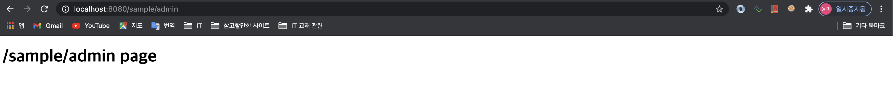

# Spring Security 설정
- 스프링 시큐리티는, 서브릿의 필터와 인터셉터를 이용하여 처리
- 필터 : 스프링과 무관한 서블릿 자원
- 인터셉터 : 스프링의 빈으로 관리되는 스프링 컨텍스트에 속함, 스프링 내부 컨트롤러 호출 마다 관여
## <font color='blue'>1. pom.xml</font>
- 의존성 추가 

```xml
    <!-- https://mvnrepository.com/artifact/org.springframework.security/spring-security-core -->
    <dependency>
        <groupId>org.springframework.security</groupId>
        <artifactId>spring-security-core</artifactId>
        <version>5.4.2</version>
    </dependency>
    <!-- https://mvnrepository.com/artifact/org.springframework.security/spring-security-web -->
    <dependency>
        <groupId>org.springframework.security</groupId>
        <artifactId>spring-security-web</artifactId>
        <version>5.4.2</version>
    </dependency>
    <!-- https://mvnrepository.com/artifact/org.springframework.security/spring-security-config -->
    <dependency>
        <groupId>org.springframework.security</groupId>
        <artifactId>spring-security-config</artifactId>
        <version>5.4.2</version>
    </dependency>
    <!-- https://mvnrepository.com/artifact/org.springframework.security/spring-security-taglibs -->
    <dependency>
        <groupId>org.springframework.security</groupId>
        <artifactId>spring-security-taglibs</artifactId>
        <version>5.4.2</version>
    </dependency>
```

## <font color='blue'>2. security-context.xml</font>
- /WEB-INF/spring 하위에 `security-context.xml` 추가
- file > new > 'Spring Bean Configuration File' 로 생성
- security-context.xml 의 네임스페이스 추가 
- 네임스페이스에 5버전이 명시되어 있다면 버전부분만 삭제하고 사용할 것. (spring-security-5.0.xsd => spring-security.xsd)
- 스프링 시큐리티를 사용하기 위한 최소한의 설정 추가

```xml
<?xml version="1.0" encoding="UTF-8"?>
<beans xmlns="http://www.springframework.org/schema/beans"
	xmlns:xsi="http://www.w3.org/2001/XMLSchema-instance"
	xmlns:security="http://www.springframework.org/schema/security"
	xsi:schemaLocation="http://www.springframework.org/schema/security http://www.springframework.org/schema/security/spring-security.xsd
		http://www.springframework.org/schema/beans http://www.springframework.org/schema/beans/spring-beans.xsd">
	<security:http>
	
		<security:form-login/>
	
	</security:http>
	
	<security:authentication-manager>
	
	</security:authentication-manager>

</beans>
```
## <font color='blue'>3. web.xml</font>
- 시큐리티 필터 빈을 재대로 이용하기 위해 스프링 설정 파일을 로딩하도록 설정
- 필터를 이용해서 시큐리티가 스프링 동작에 관여하도록 설정

```xml
<!-- 시큐리티 관련 설정파일 추가 -->
<context-param>
		<param-name>contextConfigLocation</param-name>
		<param-value>/WEB-INF/spring/root-context.xml
		/WEB-INF/spring/security-context.xml</param-value>
	</context-param>
	
	<!-- Creates the Spring Container shared by all Servlets and Filters -->
	<listener>
		<listener-class>org.springframework.web.context.ContextLoaderListener</listener-class>
	</listener>
<!-- 시큐리티 필터 추가 -->
	<filter>
		<filter-name>springSecurityFilterChain</filter-name>
		<filter-class>org.springframework.web.filter.DelegatingFilterProxy</filter-class>
	</filter>
	
	<filter-mapping>
		<filter-name>springSecurityFilterChain</filter-name>
		<url-pattern>/*</url-pattern>
	</filter-mapping>
```

## <font color='blue'>4. 기본설정 상태에서 웹서버 확인</font>

1. SecuritySampleController.java 에 URL 설계
    ```java
    package org.example.controller;

    import org.springframework.stereotype.Controller;
    import org.springframework.web.bind.annotation.GetMapping;
    import org.springframework.web.bind.annotation.RequestMapping;

    import lombok.extern.log4j.Log4j;

    @Controller
    @RequestMapping("/sample/*")
    @Log4j
    public class SecuritySampleController {
        
        @GetMapping("/all")
        public void doAll() {
            log.info("do all access everybody.");
        }
        
        @GetMapping("/member")
        public void doMember() {
            log.info("logined member.");
        }
        
        @GetMapping("/admin")
        public void doAdmin() {
            log.info("admin only.");
        }
        
        
    }
    ```
2. view/sample 하위에 URL에 맞는 jsp 작성 
- all.jsp, member.jsp, admin.jsp 생성

    ```jsp
    <%@ page language="java" contentType="text/html; charset=UTF-8"
        pageEncoding="UTF-8"%>
    <!DOCTYPE html>
    <html>
    <head>
    <meta http-equiv='Content-Type' content='text/html; charset=UTF-8'>
    <title>Insert title here</title>
    </head>
    <body>
    <h1>/sample/all page</h1>
    </body>
    </html>
    ```
3. 탐캣을 실행 시킨 후, 웹브라우저에서 화면이 잘 뜨는지 확인
- http://localhost:8080/sample/all


## <font color='blue'>5. 인증과 권한부여</font>
1. **Authentication (인증)**
- 자신을 증명하는 것, 회원가입 후 로그인 절차 같이 자신이 ID 아무개 임을 PASSWORD로 증명하는 것
2. **Authorisation (권한부여)**
- 페이지 별로, 접근이 허용되는 권한이 다른데, 그 권한이 부여된 것.
3. **인증과 권한부여를 담당하는 클래스**
- AuthenticationManager <- ProviderManager <-> AuthenticationProvider <-> UserDetailsService
4. 개발자가 시큐리티 커스터마이징 하는 방법
- 새로운 프로토콜, 인증 구현 방식 직접 구현하는 경우 : AuthenticationProvider를 직접 구현하는 방식
- UserDetailsService 구현하는 방식